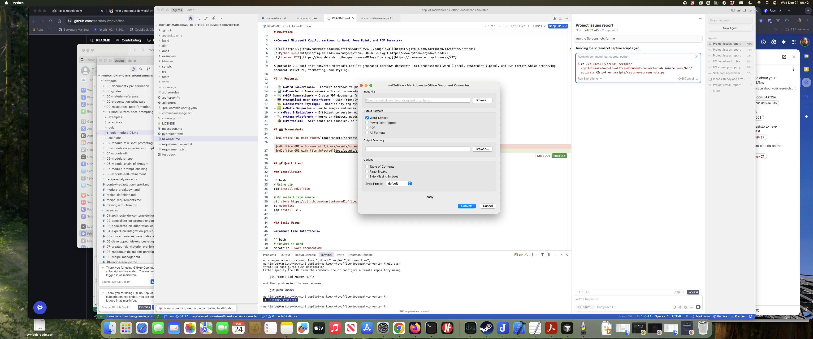
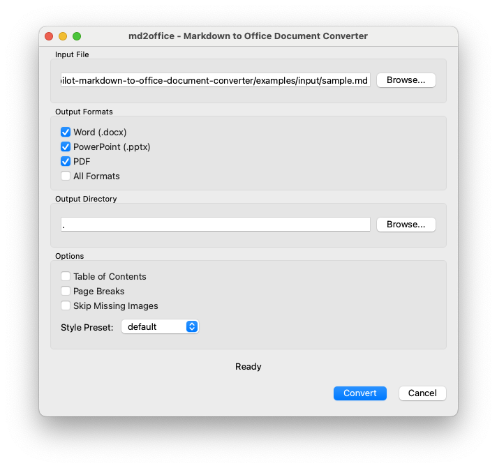

# md2office

**Convert Microsoft Copilot markdown to Word, PowerPoint, and PDF formats**

[](https://github.com/martinfou/md2office/actions)
[](https://www.python.org/downloads/)
[](https://opensource.org/licenses/MIT)

A portable CLI tool that converts Microsoft Copilot-generated markdown documents into professional Word (.docx), PowerPoint (.pptx), and PDF formats while preserving document structure, formatting, and styling.

## ✨ Features

- 📄 **Word Conversion** - Convert markdown to professional Word documents
- 📊 **PowerPoint Conversion** - Transform markdown into presentation slides
- 📑 **PDF Generation** - Create PDF documents from markdown
- 🖥️ **Graphical User Interface** - User-friendly GUI with drag-and-drop support
- 🎨 **Consistent Styling** - Unified styling system across all formats
- 🖼️ **Media Support** - Handle images and media files
- ⚡ **Fast & Reliable** - Efficient conversion with error handling
- 🔧 **Cross-Platform** - Works on Windows, macOS, and Linux
- 📦 **Portable** - Self-contained binaries, no installation required


## 📸 Screenshots






## 🚀 Quick Start

### Installation

```bash
# Using pip
pip install md2office

# Or install from source
git clone https://github.com/martinfou/md2office.git
cd md2office
pip install -e .
```

### Basic Usage

**Command Line Interface:**

```bash
# Convert to Word
md2office --word document.md

# Convert to PowerPoint
md2office --powerpoint document.md

# Convert to PDF
md2office --pdf document.md

# Convert to all formats
md2office --all document.md

# Specify output directory
md2office --word --output ./output document.md

# Convert multiple files
md2office --all --output ./output *.md

# Launch GUI
md2office --gui
# Or simply run without arguments to launch GUI
md2office
```

**Graphical User Interface:**

The GUI provides an intuitive interface for converting markdown files:

- **Drag and Drop** - Simply drag markdown files into the application window
- **File Browser** - Browse and select files using the file picker
- **Format Selection** - Choose Word, PowerPoint, PDF, or all formats
- **Output Directory** - Specify where converted files should be saved
- **Progress Tracking** - Visual progress bar during conversion
- **Error Handling** - Clear error messages if conversion fails

Launch the GUI with `md2office --gui` or run `md2office` without arguments.

## 📖 Documentation

Comprehensive documentation is available in the [`docs/`](docs/) directory:

- **[Quick Start Guide](docs/user/quickstart.md)** - Get started quickly
- **[Usage Guide](docs/user/usage.md)** - Detailed CLI usage instructions
- **[GUI User Guide](docs/user/gui.md)** - Graphical user interface guide
- **[Build Guide](docs/developer/build.md)** - Building from source
- **[Contributing](docs/contributing.md)** - How to contribute
- **[Security](docs/security.md)** - Security policy

See [Documentation Index](docs/README.md) for complete documentation.

## 🏗️ Project Structure

```
md2office/
├── src/md2office/      # Source code
│   ├── cli/            # CLI interface
│   ├── gui/            # Graphical user interface
│   ├── parser/         # Markdown parser
│   ├── generators/     # Format generators
│   ├── router/         # Content routing
│   ├── styling/        # Styling system
│   ├── config/         # Configuration
│   ├── errors/         # Error handling
│   ├── __main__.py     # Module entry point (python -m md2office)
│   └── cli_entry.py    # PyInstaller entry point
├── tests/              # Test suite
├── docs/               # Documentation
│   ├── user/           # User documentation
│   ├── developer/      # Developer documentation
│   ├── project/        # Project management docs
│   └── specs/          # Technical specifications
├── examples/           # Example files
│   ├── input/          # Sample markdown files
│   └── output/         # Sample output files
└── scripts/            # Build and utility scripts
```

## 🛠️ Development

### Setup

```bash
# Clone repository
git clone https://github.com/martinfou/md2office.git
cd md2office

# Create virtual environment
python -m venv venv
source venv/bin/activate  # On Windows: venv\Scripts\activate

# Install dependencies
# Option 1: Using pyproject.toml (recommended)
pip install -e .[dev]

# Option 2: Using requirements files
pip install -r requirements.txt
pip install -r requirements-dev.txt

# Install pre-commit hooks
pre-commit install
```

### Running Tests

```bash
# Run all tests
pytest

# Run with coverage
pytest --cov=md2office --cov-report=html

# Run specific test
pytest tests/test_cli.py
```

### Building

The build scripts automatically set up a virtual environment, install dependencies, and build the binary. The build uses the folder method (`--onedir`) for faster startup times.

**On Windows:**
```bash
scripts\build.bat
# Output: dist\md2office\md2office.exe (and all dependencies)
```

**On macOS/Linux:**
```bash
./scripts/build.sh
# Output: dist/md2office/md2office (and all dependencies)
```

**Manual build (if venv already set up):**
```bash
# Windows
python scripts\build.py

# macOS/Linux
python scripts/build.py
```

**Using PyInstaller directly:**
```bash
pyinstaller scripts/pyinstaller.spec
```

**Note:** To build for both Windows and macOS, you need to run the build script on each platform. The GitHub Actions workflows automatically build for both platforms when you push a tag.

### Capturing Screenshots

To capture screenshots of the GUI for documentation:

**macOS/Linux:**
```bash
./scripts/capture-screenshots.sh
# Or
python scripts/capture-screenshots.py
```

**Windows:**
```bash
scripts\capture-screenshots.bat
```

The script will:
1. Launch the GUI application
2. Wait for you to position the window
3. Capture screenshots automatically
4. Update README.md with screenshot references

Screenshots are saved to `docs/assets/screenshots/`.

### Entry Points

The application can be invoked in multiple ways:

- **CLI command:** `md2office [OPTIONS]` (after `pip install`)
- **Python module:** `python -m md2office [OPTIONS]`
- **GUI mode:** `md2office --gui` or `md2office` (no arguments)

All entry points use the same underlying conversion engine. See [Entry Points Architecture](docs/developer/entry-points.md) for technical details.

## 📋 Requirements

- Python 3.8 or higher
- See [pyproject.toml](pyproject.toml) for dependencies (or [requirements.txt](requirements.txt))

### Optional Dependencies

**Mermaid Diagram Rendering** (for PowerPoint):
- Node.js (install from [nodejs.org](https://nodejs.org/))
- mermaid-cli: `npm install -g @mermaid-js/mermaid-cli`
- Enables rendering of Mermaid diagrams as images in PowerPoint slides
- Without this, Mermaid code blocks will be displayed as text

## 🤝 Contributing

Contributions are welcome! Please read our [Contributing Guidelines](docs/contributing.md) for details.

1. Fork the repository
2. Create a feature branch (`git checkout -b feature/amazing-feature`)
3. Commit your changes (`git commit -m 'Add amazing feature'`)
4. Push to the branch (`git push origin feature/amazing-feature`)
5. Open a Pull Request

## 📝 License

This project is licensed under the MIT License - see the [LICENSE](LICENSE) file for details.

## 🔒 Security

Please report security vulnerabilities via [GitHub Security Advisories](https://github.com/martinfou/md2office/security/advisories/new). See [SECURITY.md](docs/security.md) for details.

## 🙏 Acknowledgments

- Built with Python and love
- Uses [python-docx](https://github.com/python-openxml/python-docx) for Word generation
- Uses [python-pptx](https://github.com/scanny/python-pptx) for PowerPoint generation
- Uses [ReportLab](https://www.reportlab.com/) for PDF generation

## 📊 Status

**Current Version**: 0.1.0  
**Status**: Core Implementation Complete (96.4%)  
**Python Support**: 3.8, 3.9, 3.10, 3.11, 3.12

## 🔗 Links

- [Documentation](docs/)
- [Issue Tracker](https://github.com/martinfou/md2office/issues)
- [Contributing Guide](docs/contributing.md)
- [Security Policy](docs/security.md)

---

**Made with ❤️ for the community**
