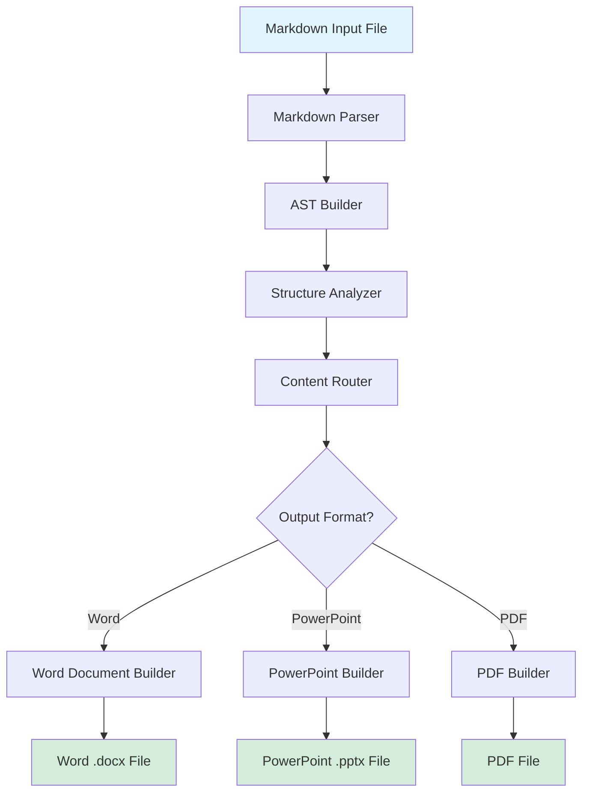
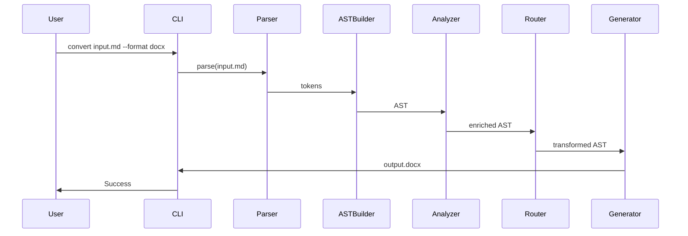

# Conversion Architecture

## Architecture Overview

The Copilot Markdown to Office Document Converter follows a modular pipeline architecture that transforms markdown content through distinct stages: parsing, structure analysis, format routing, and format-specific generation. The architecture is designed to support multiple output formats (Word, PowerPoint, PDF) while maintaining a single parsing and analysis pipeline, ensuring consistency and reducing code duplication.

The architecture emphasizes:
- **Separation of Concerns**: Each stage has a clear responsibility
- **Extensibility**: Easy to add new output formats
- **Consistency**: Shared parsing and analysis ensures consistent interpretation
- **Performance**: Efficient processing pipeline for batch conversions
- **Error Handling**: Graceful degradation for malformed content

## Conversion Pipeline

The conversion process flows through the following stages:



### Stage 1: Markdown Parsing

**Input**: Raw markdown text file (`.md`)

**Process**:
- Parse markdown syntax using CommonMark/GFM parser
- Tokenize all markdown elements
- Extract metadata (if present in front-matter)
- Handle Copilot-specific formatting patterns

**Output**: Tokenized markdown elements with metadata

**Key Components**:
- **Markdown Lexer**: Tokenizes markdown syntax
- **Parser Engine**: Builds parse tree from tokens
- **Extension Handler**: Processes GFM extensions (tables, task lists, strikethrough)

### Stage 2: AST Building

**Input**: Tokenized markdown elements

**Process**:
- Build Abstract Syntax Tree (AST) representation
- Organize elements hierarchically
- Preserve document structure and relationships
- Attach metadata to AST nodes

**Output**: Structured AST with all document elements

**Key Components**:
- **AST Node Factory**: Creates typed nodes for each element
- **Hierarchy Builder**: Establishes parent-child relationships
- **Metadata Attacher**: Associates properties with nodes

### Stage 3: Structure Analysis

**Input**: Complete AST

**Process**:
- Analyze document hierarchy (heading levels, nesting)
- Identify content types and patterns
- Detect document sections and boundaries
- Extract structural metadata (TOC candidates, section counts)
- Analyze content for format-specific routing decisions

**Output**: Enriched AST with structural analysis metadata

**Key Components**:
- **Hierarchy Analyzer**: Analyzes heading structure
- **Content Type Detector**: Identifies content patterns
- **Section Boundary Detector**: Finds logical document sections
- **Metadata Extractor**: Gathers document-level information

### Stage 4: Content Routing

**Input**: Enriched AST with analysis metadata

**Process**:
- Determine target output format(s)
- Route content to appropriate format generators
- Apply format-specific transformation rules
- Handle multi-format generation scenarios

**Output**: Format-specific content representations

**Key Components**:
- **Format Router**: Routes content to generators
- **Transformation Engine**: Applies format-specific rules
- **Multi-Format Coordinator**: Manages parallel format generation

### Stage 5: Format-Specific Generation

**Input**: Transformed content for specific format

**Process**:
- Generate format-specific document structure
- Apply styling and formatting rules
- Embed media and resources
- Finalize document output

**Output**: Complete document file (`.docx`, `.pptx`, `.pdf`)

**Key Components** (per format):
- **Document Builder**: Creates document structure
- **Styling Engine**: Applies formatting rules
- **Media Embedder**: Handles images and media
- **File Writer**: Writes final output file

## Format Routing

The architecture supports three output formats, each with distinct routing logic:

### Word Document Routing

**Trigger**: User requests Word output (`--format docx` or default)

**Routing Logic**:
- All markdown content flows to Word generator
- Linear document structure (sequential content flow)
- Preserves markdown hierarchy as Word heading styles
- Maintains document flow from top to bottom

**Special Considerations**:
- Page breaks can be inserted at major section boundaries (H1/H2)
- Table of contents generation from heading hierarchy
- Footnotes/endnotes support if needed
- Document properties (title, author) from metadata

### PowerPoint Routing

**Trigger**: User requests PowerPoint output (`--format pptx`)

**Routing Logic**:
- Heading hierarchy determines slide structure
- H1 typically becomes title slide or section divider
- H2 becomes slide titles
- Content under H2 becomes slide content
- Nested headings (H3+) become slide subsections

**Special Considerations**:
- Slide layout selection based on content type
- Content splitting for long sections
- Bullet point conversion from lists
- Image placement on slides
- Slide transitions and animations (optional)

### PDF Routing

**Trigger**: User requests PDF output (`--format pdf`)

**Routing Logic**:
- Can be generated directly from markdown or via Word intermediate
- Preserves document structure with bookmarks
- Maintains formatting and layout
- Supports table of contents generation

**Special Considerations**:
- Page layout and margins
- Bookmark generation from headings
- Hyperlink preservation
- Image embedding and positioning
- Print optimization

## Component Design

### Core Components

#### 1. Markdown Parser

**Responsibility**: Parse markdown syntax into structured representation

**Key Functions**:
- `parse(markdownText: string): AST`
- `parseFile(filePath: string): AST`
- `validateSyntax(markdownText: string): ValidationResult`

**Dependencies**: Markdown parsing library (e.g., markdown-it, marked, commonmark)

**Output**: Abstract Syntax Tree (AST)

#### 2. AST Builder

**Responsibility**: Build and enrich Abstract Syntax Tree

**Key Functions**:
- `buildAST(tokens: Token[]): ASTNode`
- `enrichAST(ast: ASTNode): EnrichedAST`
- `validateAST(ast: ASTNode): ValidationResult`

**AST Node Types**:
- `DocumentNode`: Root document node
- `HeadingNode`: Headers (H1-H6)
- `ParagraphNode`: Text paragraphs
- `ListNode`: Ordered/unordered/task lists
- `ListItemNode`: Individual list items
- `CodeBlockNode`: Fenced code blocks
- `InlineCodeNode`: Inline code
- `TableNode`: Markdown tables
- `ImageNode`: Images
- `LinkNode`: Hyperlinks
- `BlockquoteNode`: Blockquotes
- `HorizontalRuleNode`: Horizontal rules
- `TextNode`: Plain text content

#### 3. Structure Analyzer

**Responsibility**: Analyze document structure and extract metadata

**Key Functions**:
- `analyzeHierarchy(ast: ASTNode): HierarchyInfo`
- `detectSections(ast: ASTNode): Section[]`
- `extractMetadata(ast: ASTNode): DocumentMetadata`
- `identifyContentTypes(ast: ASTNode): ContentType[]`

**Analysis Output**:
- Document hierarchy tree
- Section boundaries and levels
- Content type distribution
- Metadata (title, author, date)
- Table of contents structure

#### 4. Content Router

**Responsibility**: Route content to format-specific generators

**Key Functions**:
- `routeToFormat(ast: ASTNode, format: OutputFormat): RoutedContent`
- `transformForFormat(ast: ASTNode, format: OutputFormat): TransformedAST`
- `applyFormatRules(ast: ASTNode, rules: FormatRules): ASTNode`

**Routing Rules**:
- Format-specific transformation rules
- Content filtering (if needed)
- Structure adaptation for format

#### 5. Format Generators

**Responsibility**: Generate format-specific output files

**Word Generator**:
- `generateWordDocument(ast: ASTNode, options: WordOptions): WordDocument`
- `applyWordStyling(document: WordDocument, styles: StyleSheet): WordDocument`
- `embedMedia(document: WordDocument, media: Media[]): WordDocument`

**PowerPoint Generator**:
- `generatePowerPoint(ast: ASTNode, options: PowerPointOptions): PowerPoint`
- `createSlides(ast: ASTNode, layoutStrategy: LayoutStrategy): Slide[]`
- `applySlideStyling(slides: Slide[], theme: Theme): Slide[]`

**PDF Generator**:
- `generatePDF(ast: ASTNode, options: PDFOptions): PDFDocument`
- `applyPDFStyling(document: PDFDocument, styles: StyleSheet): PDFDocument`
- `generateBookmarks(document: PDFDocument, hierarchy: HierarchyInfo): PDFDocument`

### Supporting Components

#### Media Handler

**Responsibility**: Process and embed images and media files

**Key Functions**:
- `resolveImagePath(path: string, basePath: string): string`
- `loadImage(path: string): ImageData`
- `optimizeImage(image: ImageData, options: ImageOptions): ImageData`
- `embedImage(document: Document, image: ImageData, position: Position): Document`

#### Style Manager

**Responsibility**: Manage styling and formatting rules

**Key Functions**:
- `loadStyleSheet(format: OutputFormat): StyleSheet`
- `applyStyles(document: Document, styles: StyleSheet): Document`
- `mergeStyles(baseStyles: StyleSheet, customStyles: StyleSheet): StyleSheet`

#### Error Handler

**Responsibility**: Handle errors and edge cases gracefully

**Key Functions**:
- `handleParseError(error: ParseError): ErrorReport`
- `handleMissingResource(resource: string): FallbackStrategy`
- `validateOutput(document: Document, format: OutputFormat): ValidationResult`

## Data Flow

### Input Data Flow



### Internal Data Structures

#### AST Node Structure

```typescript
interface ASTNode {
  type: NodeType;
  content?: string;
  children?: ASTNode[];
  attributes?: Record<string, any>;
  metadata?: NodeMetadata;
}

interface NodeMetadata {
  level?: number;           // For headings
  language?: string;        // For code blocks
  url?: string;            // For links/images
  alt?: string;            // For images
  title?: string;          // For links/images
  ordered?: boolean;       // For lists
  checked?: boolean;       // For task lists
  alignment?: string;      // For tables
}
```

#### Document Metadata Structure

```typescript
interface DocumentMetadata {
  title?: string;
  author?: string;
  date?: Date;
  description?: string;
  keywords?: string[];
  customProperties?: Record<string, any>;
}
```

#### Hierarchy Information Structure

```typescript
interface HierarchyInfo {
  root: HierarchyNode;
  depth: number;
  sectionCount: number;
  tocStructure: TOCEntry[];
}

interface HierarchyNode {
  level: number;
  title: string;
  children: HierarchyNode[];
  contentNodes: ASTNode[];
}
```

## Conversion Strategy

### Strategy Principles

1. **Preservation First**: Preserve markdown structure and content as faithfully as possible
2. **Format Adaptation**: Adapt content structure to fit format conventions while maintaining meaning
3. **Graceful Degradation**: Handle missing or malformed content gracefully
4. **Consistency**: Ensure consistent interpretation across formats
5. **Extensibility**: Design for easy addition of new formats or features

### Conversion Approaches

#### Direct Conversion

- **Markdown → Word**: Direct mapping with Word-specific styling
- **Markdown → PowerPoint**: Structure-based slide generation
- **Markdown → PDF**: Direct PDF generation or Word→PDF conversion

#### Intermediate Conversion

- **Markdown → Word → PDF**: Use Word as intermediate format for PDF generation
- **Markdown → HTML → PDF**: Use HTML as intermediate format (alternative approach)

**Decision**: Prefer direct conversion for better control and consistency, but support intermediate conversion when necessary (e.g., complex Word features for PDF).

### Content Transformation Rules

#### Structure Preservation

- Maintain heading hierarchy across formats
- Preserve list nesting and structure
- Keep table structure and alignment
- Maintain code block formatting

#### Format Adaptation

- Adapt heading levels to format conventions (e.g., PowerPoint slide structure)
- Convert lists to format-appropriate list styles
- Adjust spacing and layout for format requirements
- Apply format-specific styling conventions

#### Content Enhancement

- Add format-specific features (e.g., TOC, bookmarks)
- Enhance visual presentation with format capabilities
- Add navigation aids (hyperlinks, bookmarks)
- Include metadata in document properties

## Error Handling Strategy

### Error Categories

1. **Parse Errors**: Malformed markdown syntax
2. **Resource Errors**: Missing images or media files
3. **Format Errors**: Incompatible content for target format
4. **System Errors**: File system, memory, or other system issues

### Error Handling Approach

- **Parse Errors**: Report error location, attempt to continue with partial parsing
- **Resource Errors**: Log warning, use placeholder or skip resource
- **Format Errors**: Apply fallback transformation, log warning
- **System Errors**: Fail gracefully with clear error message

### Error Reporting

- Console output for user-facing errors
- Log file for detailed error information
- Validation reports for batch processing
- Exit codes for script integration

## Performance Considerations

### Optimization Strategies

1. **Streaming Processing**: Process large documents in chunks
2. **Lazy Loading**: Load resources only when needed
3. **Caching**: Cache parsed AST and generated content
4. **Parallel Processing**: Generate multiple formats in parallel
5. **Resource Optimization**: Optimize images and media during embedding

### Scalability

- Handle documents of various sizes (small to very large)
- Support batch conversion of multiple files
- Efficient memory usage for large documents
- Fast processing for typical document sizes

## Extension Points

### Adding New Output Formats

1. Create new format generator component
2. Define format-specific transformation rules
3. Register generator in content router
4. Add CLI options for new format

### Adding New Markdown Extensions

1. Extend parser to handle new syntax
2. Add new AST node types
3. Define mappings for new elements
4. Update format generators to handle new nodes

### Customization Points

- Style sheets (format-specific styling)
- Layout strategies (especially for PowerPoint)
- Media handling (optimization, placement)
- Error handling (custom fallback strategies)

## Architecture Decisions

### Decision 1: Single Parser vs. Format-Specific Parsers

**Decision**: Single shared parser for all formats

**Rationale**: 
- Ensures consistent interpretation across formats
- Reduces code duplication
- Simplifies maintenance
- Single source of truth for markdown parsing

### Decision 2: AST-Based vs. Stream-Based Processing

**Decision**: AST-based processing

**Rationale**:
- Enables structure analysis and optimization
- Supports complex transformations
- Allows multiple passes over content
- Better error recovery and validation

### Decision 3: Direct vs. Intermediate Format Conversion

**Decision**: Prefer direct conversion, support intermediate when needed

**Rationale**:
- Direct conversion provides better control
- Reduces conversion artifacts
- Faster processing
- Intermediate conversion useful for complex features

### Decision 4: Monolithic vs. Modular Generators

**Decision**: Modular generators with shared components

**Rationale**:
- Code reuse for common functionality
- Easier testing and maintenance
- Clear separation of concerns
- Extensibility for new formats

## Implementation Considerations

### Technology Stack Recommendations

- **Markdown Parser**: CommonMark.js, markdown-it, or marked
- **Word Generation**: docx library (JavaScript), python-docx (Python), or similar
- **PowerPoint Generation**: PptxGenJS (JavaScript), python-pptx (Python), or similar
- **PDF Generation**: PDFKit, jsPDF, or similar libraries
- **Language**: JavaScript/TypeScript (Node.js) or Python recommended for cross-platform support

### Dependencies Management

- Minimize external dependencies
- Prefer well-maintained libraries
- Bundle dependencies in portable binary
- Handle version conflicts gracefully

### Testing Strategy

- Unit tests for each component
- Integration tests for conversion pipeline
- End-to-end tests for complete conversions
- Regression tests for edge cases

## Conclusion

This conversion architecture provides a solid foundation for building a robust markdown-to-document converter. The modular pipeline design ensures maintainability, extensibility, and consistency across all output formats. The architecture supports the requirements for Word, PowerPoint, and PDF generation while remaining flexible enough to accommodate future enhancements and format additions.

