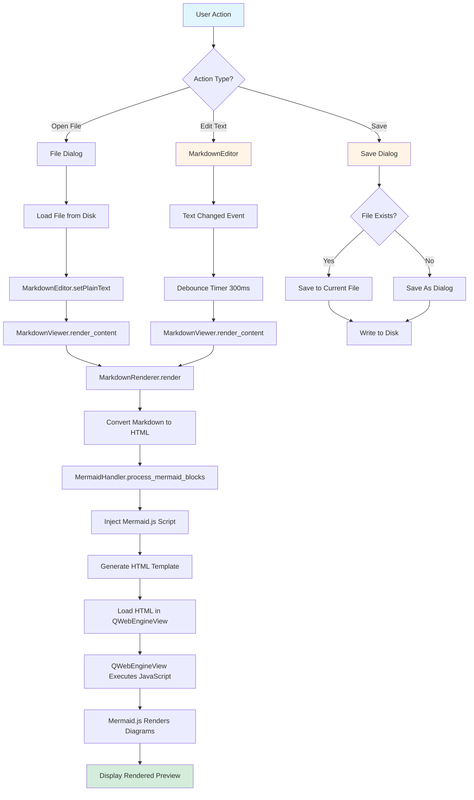
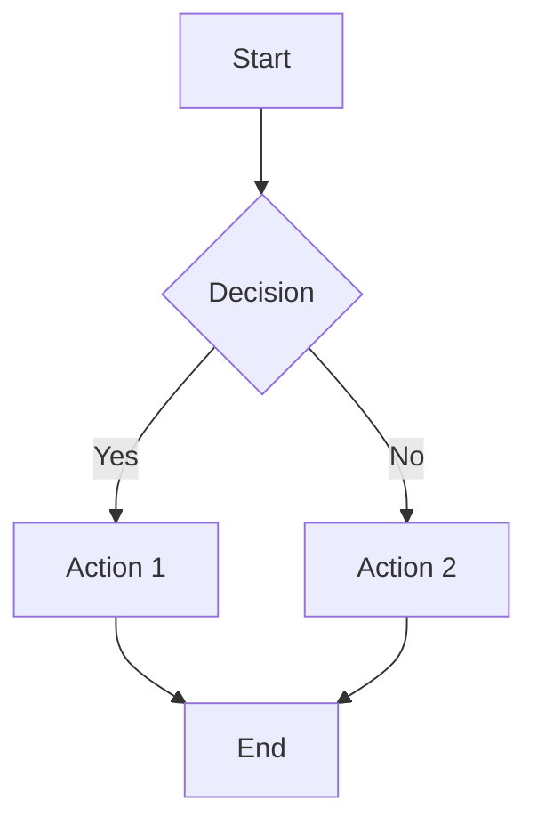
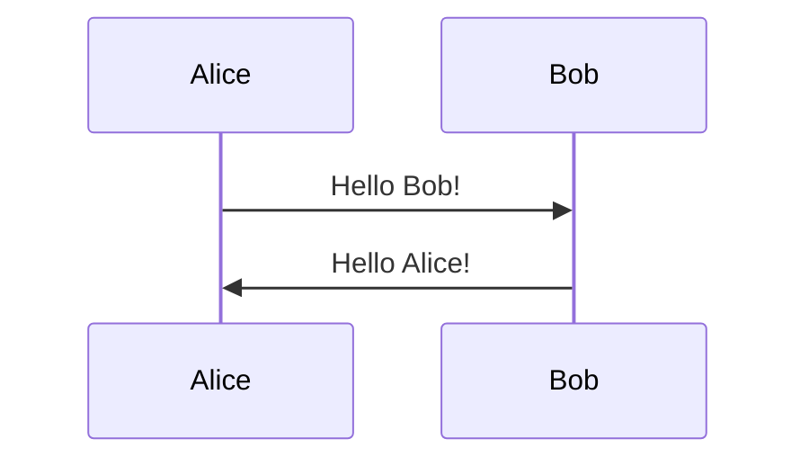
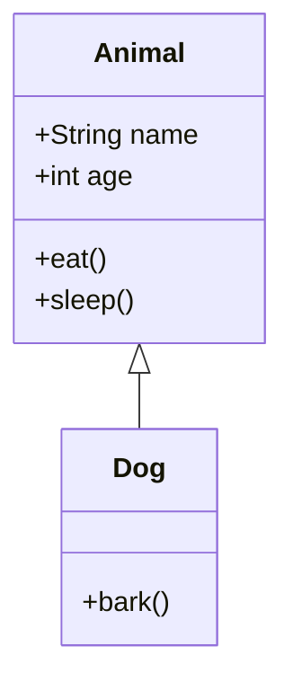

# Markdown Viewer with Mermaid.js Support - Requirements Document

**Version:** 1.0  
**Date:** 2024-01-15  
**Status:** Draft  
**Author:** Technical Requirements Analyst

---

## Table of Contents

1. [Executive Summary](#1-executive-summary)
2. [Functional Requirements](#2-functional-requirements)
3. [Technical Requirements](#3-technical-requirements)
4. [UI/UX Requirements](#4-uiux-requirements)
5. [Implementation Phases](#5-implementation-phases)
6. [Testing Requirements](#6-testing-requirements)
7. [Documentation Requirements](#7-documentation-requirements)
8. [Acceptance Criteria](#8-acceptance-criteria)
9. [Risks and Mitigations](#9-risks-and-mitigations)
10. [Future Enhancements](#10-future-enhancements)
11. [Appendices](#11-appendices)

---

## 1. Executive Summary

### 1.1 Overview

The md2office application currently provides conversion capabilities from Markdown to Office formats (Word, PowerPoint, PDF) but lacks preview functionality. Users cannot verify markdown content, including Mermaid.js diagrams, before conversion. This feature will add a comprehensive markdown viewer and editor component with Mermaid.js diagram rendering support, integrated seamlessly into the existing PySide6-based GUI. The component will enable users to view, edit, save, and load markdown documents directly within the application.

### 1.2 Business Justification

**User Benefits:**
- **Content Verification**: Users can preview markdown content before conversion, reducing errors and rework
- **Diagram Validation**: Mermaid.js diagrams can be verified for correctness before conversion
- **Improved Confidence**: Users gain confidence in the conversion process by seeing rendered output
- **Time Savings**: Early detection of formatting issues reduces post-conversion editing time
- **Quality Assurance**: Technical writers and content creators can ensure document quality before sharing
- **Integrated Editing**: Users can edit markdown documents directly within the application without external editors
- **Live Preview**: Real-time preview updates as users edit markdown content
- **Document Management**: Save and load markdown files with proper file handling and change tracking

**Business Value:**
- Reduces support requests related to conversion errors
- Improves user satisfaction and adoption rates
- Enables users to catch issues early in the workflow
- Supports the application's positioning as a professional document conversion tool

### 1.3 High-Level Technical Approach

The markdown viewer and editor will be implemented as a new component within the existing `md2office.gui` module:

1. **Rendering Engine**: Use `QWebEngineView` (PySide6) to render HTML-based markdown preview with embedded JavaScript for Mermaid.js
2. **Editing Interface**: Use `QPlainTextEdit` or `QTextEdit` for markdown source editing with syntax highlighting
3. **Markdown Processing**: Leverage existing `md2office.parser` module or integrate `markdown`/`mistune` library for HTML conversion
4. **Integration**: Add editor and preview panes to `MainWindow` using `QSplitter` for resizable three-pane layout (conversion UI, editor, preview)
5. **Mermaid.js**: Load Mermaid.js library from CDN or bundle locally, execute via QWebEngineView's JavaScript bridge
6. **File Management**: Implement save/load functionality with change tracking, unsaved changes warnings, and file dialogs
7. **Architecture**: Follow existing patterns in `md2office.gui` module (workers, signals/slots, error handling)

---

## 2. Functional Requirements

### 2.1 FR-1: Markdown Rendering and Display

**Requirement ID:** FR-1  
**Priority:** High  
**Status:** Required

#### 2.1.1 Standard Markdown Syntax Support

The viewer must render all standard CommonMark markdown elements:

- **Headings** (H1-H6): Proper hierarchy and styling
- **Paragraphs**: Text blocks with proper spacing
- **Lists**: 
  - Unordered lists (bullet points)
  - Ordered lists (numbered)
  - Nested lists (multiple levels)
- **Code Blocks**: 
  - Fenced code blocks with language specification
  - Syntax highlighting for supported languages
  - Inline code spans
- **Tables**: GitHub Flavored Markdown (GFM) table syntax
- **Links**: Inline and reference-style links
- **Images**: Embedded images with alt text support
- **Blockquotes**: Quoted text blocks
- **Horizontal Rules**: Thematic breaks
- **Emphasis**: Bold (`**text**`) and italic (`*text*`)
- **Strikethrough**: GFM strikethrough (`~~text~~`)

#### 2.1.2 GitHub Flavored Markdown (GFM) Extensions

Support GFM-specific features:

- **Task Lists**: Checkboxes (`- [ ]` and `- [x]`)
- **Tables**: Extended table syntax with alignment
- **Autolinks**: Automatic URL detection
- **Strikethrough**: Text strikethrough support

#### 2.1.3 Frontmatter/Metadata Handling

- Detect and parse YAML frontmatter (if present)
- Display metadata in a structured format or hide it (configurable)
- Preserve frontmatter for conversion pipeline

#### 2.1.4 Syntax Highlighting

- Support syntax highlighting for code blocks using a JavaScript library (e.g., highlight.js, Prism.js)
- Highlight common languages: Python, JavaScript, TypeScript, Bash, SQL, JSON, YAML, Markdown, etc.
- Fallback to plain text if language not supported
- Configurable color scheme (light/dark)

#### 2.1.5 Image Handling

- Display images referenced in markdown
- Support relative and absolute paths
- Handle missing images gracefully (show placeholder or error message)
- Support common image formats: PNG, JPG, JPEG, GIF, SVG, WebP
- Respect image size constraints (max width/height)

**Acceptance Criteria:**
- All standard markdown elements render correctly
- GFM extensions work as expected
- Code blocks display with syntax highlighting
- Images load and display correctly (when available)
- Frontmatter is handled appropriately

---

### 2.2 FR-2: Mermaid.js Diagram Rendering

**Requirement ID:** FR-2  
**Priority:** High  
**Status:** Required

#### 2.2.1 Mermaid Code Block Detection

- Detect Mermaid code blocks using the pattern: ` ```mermaid ... ``` `
- Support both lowercase and uppercase `mermaid` identifier
- Handle code blocks with or without trailing newlines

#### 2.2.2 Diagram Type Support

Support all major Mermaid diagram types:

- **Flowcharts**: Flow diagrams with nodes and edges
- **Sequence Diagrams**: Interaction sequences between actors
- **Class Diagrams**: UML class diagrams
- **State Diagrams**: State machine diagrams
- **Entity Relationship Diagrams**: ER diagrams
- **Gantt Charts**: Project timeline charts
- **Pie Charts**: Pie chart visualizations
- **Gitgraph**: Git branch visualization
- **Journey Diagrams**: User journey maps
- **C4 Diagrams**: C4 model diagrams (if supported by version)
- **Mindmaps**: Mind map diagrams

#### 2.2.3 Mermaid Configuration

- Support Mermaid configuration via frontmatter or configuration file
- Allow theme selection (default, dark, forest, neutral)
- Support custom Mermaid initialization options
- Respect Mermaid version compatibility

#### 2.2.4 Error Handling

- Detect Mermaid syntax errors gracefully
- Display user-friendly error messages for invalid diagrams
- Show diagram source code when rendering fails
- Log errors for debugging purposes
- Provide option to retry rendering

#### 2.2.5 Rendering Performance

- Render diagrams asynchronously to avoid blocking UI
- Show loading indicators for large diagrams
- Cache rendered diagrams when possible
- Support lazy loading for diagrams below viewport

**Acceptance Criteria:**
- All Mermaid diagram types render correctly
- Invalid Mermaid syntax shows helpful error messages
- Diagrams render within acceptable time (< 2 seconds for typical diagrams)
- Mermaid configuration is respected
- Multiple diagrams in one document render independently

---

### 2.3 FR-3: Viewer Integration with Existing GUI

**Requirement ID:** FR-3  
**Priority:** High  
**Status:** Required

#### 2.3.1 MainWindow Integration

- Add preview pane to existing `MainWindow` class (`src/md2office/gui/main_window.py`)
- Use `QSplitter` widget for resizable horizontal or vertical split
- Maintain existing conversion workflow and UI elements
- Preserve existing drag-and-drop functionality for markdown files

#### 2.3.2 File Synchronization

- Automatically load and render markdown when file is selected via:
  - File browser dialog
  - Drag-and-drop
  - Command-line argument (if GUI launched with file)
- Update preview when a different file is selected
- Clear preview when no file is selected

#### 2.3.3 File Watching (Optional)

- Optionally watch markdown file for changes
- Auto-refresh preview when file is modified externally
- Debounce file change events (wait 500ms after last change)
- Show indicator when file has been modified externally
- Provide manual refresh button

#### 2.3.4 Conversion Workflow Integration

- Preview does not interfere with conversion process
- Conversion can proceed while preview is visible
- Preview state persists during conversion
- Option to hide/show preview pane (toggle button)

**Acceptance Criteria:**
- Preview pane integrates seamlessly with existing MainWindow
- File selection triggers preview update
- Existing conversion functionality remains unaffected
- Preview can be toggled on/off without breaking UI

---

### 2.4 FR-4: User Interaction Features

**Requirement ID:** FR-4  
**Priority:** Medium  
**Status:** Required (MVP) / Optional (Advanced)

#### 2.4.1 Scroll Synchronization (Optional)

- Optionally synchronize scroll position between markdown source and preview
- Implement bidirectional sync (source → preview or preview → source)
- Allow users to enable/disable synchronization
- Handle large documents efficiently

#### 2.4.2 Zoom Controls

- Provide zoom in/out controls for preview
- Support keyboard shortcuts (Ctrl/Cmd + Plus/Minus)
- Reset zoom button
- Zoom range: 50% to 200%
- Persist zoom level per session

#### 2.4.3 Copy Rendered Content

- Copy rendered HTML to clipboard
- Copy selected text from preview
- Copy diagram as image (for Mermaid diagrams)
- Context menu with copy options

#### 2.4.4 Print Preview (Optional)

- Generate print-friendly version of preview
- Support page breaks and margins
- Print dialog integration

#### 2.4.5 Export Preview (Optional)

- Export preview as standalone HTML file
- Export preview as PDF
- Export individual diagrams as images (PNG/SVG)
- Include all assets (images, stylesheets) in export

**Acceptance Criteria:**
- Zoom controls work smoothly
- Copy functionality works for text and diagrams
- Export features generate valid files
- All interactions are responsive and intuitive

---

### 2.5 FR-5: Markdown Editing, Saving, and Loading

**Requirement ID:** FR-5  
**Priority:** High  
**Status:** Required

#### 2.5.1 Markdown Source Editing

- Provide editable text area for markdown source code
- Support standard text editing features:
  - Cut, copy, paste
  - Undo/redo functionality
  - Find and replace
  - Line numbers (optional)
  - Word wrap toggle
- Syntax highlighting for markdown (optional enhancement)
- Auto-indentation for lists and code blocks
- Bracket/parenthesis matching
- Line highlighting for current cursor position

#### 2.5.2 Live Preview Updates

- Update preview pane automatically as user types (debounced)
- Debounce delay: 300-500ms after last keystroke
- Show loading indicator during preview update
- Option to disable live preview (manual refresh mode)
- Sync scroll position between editor and preview (optional)

#### 2.5.3 File Loading

- Load markdown files from file system:
  - File browser dialog (Open File)
  - Drag-and-drop support
  - Command-line argument support
  - Recent files menu (optional)
- Handle file encoding (UTF-8, UTF-8 with BOM, etc.)
- Detect and preserve line endings (LF, CRLF, CR)
- Validate file is valid markdown (warn if binary or invalid)
- Show file path in status bar or title

#### 2.5.4 File Saving

- Save markdown content to file:
  - Save (Ctrl/Cmd + S) - save to current file
  - Save As (Ctrl/Cmd + Shift + S) - save to new file
  - Save dialog with file type filter (.md, .markdown)
- Preserve file encoding and line endings
- Handle save errors gracefully (permissions, disk full, etc.)
- Show save confirmation or status indicator
- Update file path after Save As

#### 2.5.5 Change Tracking

- Track document modification state (modified/clean)
- Show visual indicator when document has unsaved changes:
  - Asterisk (*) in window title
  - Status bar indicator
  - Modified flag in file path display
- Prompt user before closing/loading if unsaved changes exist
- Option to discard changes or cancel operation

#### 2.5.6 New Document Support

- Create new empty markdown document
- File → New (Ctrl/Cmd + N)
- Prompt to save current document if modified
- Initialize with empty content or template
- Set document as "Untitled" until first save

#### 2.5.7 File Operations

- Close current document (File → Close or Ctrl/Cmd + W)
- Revert to last saved version (File → Revert)
- Reload from disk (File → Reload)
- Handle external file modifications:
  - Detect when file is modified externally
  - Prompt user to reload or keep current version
  - Show conflict resolution dialog

**Acceptance Criteria:**
- Users can edit markdown source code in text editor
- Preview updates automatically as user types (with debouncing)
- Files can be loaded via file dialog or drag-and-drop
- Files can be saved with proper encoding and line endings
- Unsaved changes are tracked and user is warned before losing changes
- New documents can be created
- File operations (close, revert, reload) work correctly

---

## 3. Technical Requirements

### 3.1 TR-1: Technology Stack and Dependencies

**Requirement ID:** TR-1  
**Priority:** High  
**Status:** Required

#### 3.1.1 Markdown Rendering Library

**Recommended Approach:** Use `markdown` library (Python-Markdown) with extensions

**Rationale:**
- Mature and well-maintained library
- Extensive extension support (GFM, code highlighting)
- Good performance for typical document sizes
- Compatible with Python 3.8+

**Dependencies:**
```python
# Required dependencies
markdown>=3.4.0          # Core markdown parser
markdown-extensions>=0.6.0  # GFM extensions
Pygments>=2.14.0         # Syntax highlighting (optional, for server-side)
```

**Alternative Libraries:**
- `mistune>=3.0.0`: Fast, pure Python parser (alternative)
- `markdown2>=2.4.0`: Simple alternative (less feature-rich)

#### 3.1.2 Mermaid.js Integration

**Recommended Approach:** Use `QWebEngineView` with embedded Mermaid.js

**Rationale:**
- `QWebEngineView` provides full Chromium-based browser engine
- Native JavaScript execution support
- Can load Mermaid.js from CDN or bundle locally
- Cross-platform compatibility (Windows, macOS, Linux)

**Mermaid.js Loading Options:**

**Option A: CDN (Recommended for Development)**
- Load from `https://cdn.jsdelivr.net/npm/mermaid@10/dist/mermaid.min.js`
- Pros: Always latest version, no bundling needed
- Cons: Requires internet connection, potential security concerns

**Option B: Bundled (Recommended for Production)**
- Bundle Mermaid.js library with application
- Load from local file system
- Pros: Works offline, more secure, faster loading
- Cons: Larger application size, version management

**Implementation:**
```python
from PySide6.QtWebEngineWidgets import QWebEngineView
from PySide6.QtWebEngineCore import QWebEngineSettings

# Enable JavaScript
settings = QWebEngineSettings.globalSettings()
settings.setAttribute(QWebEngineSettings.JavascriptEnabled, True)
```

#### 3.1.3 Syntax Highlighting

**Recommended Approach:** Use `highlight.js` or `Prism.js` in browser

**Rationale:**
- Client-side highlighting reduces server processing
- Better performance for large code blocks
- Extensive language support
- Easy to integrate with QWebEngineView

**Dependencies:**
- Load highlight.js from CDN: `https://cdnjs.cloudflare.com/ajax/libs/highlight.js/11.9.0/highlight.min.js`
- Or bundle locally for offline support

#### 3.1.4 New Dependencies Summary

**Required Dependencies:**
```toml
# Add to pyproject.toml dependencies
"markdown>=3.4.0",
"markdown-extensions>=0.6.0",
# PySide6.QtWebEngineWidgets is part of PySide6 (may need separate install)
```

**Optional Dependencies:**
```toml
# For advanced features
"watchdog>=3.0.0",  # File watching (optional)
"Pillow>=10.0.0",   # Image processing (if needed)
```

**PySide6 WebEngine Module:**
- On some platforms, `PySide6-QtWebEngine` may need separate installation
- Verify availability: `from PySide6.QtWebEngineWidgets import QWebEngineView`

#### 3.1.5 Security Considerations

**JavaScript Execution:**
- QWebEngineView executes JavaScript in isolated context
- Only load trusted JavaScript libraries (Mermaid.js, highlight.js)
- Sanitize markdown content before rendering to prevent XSS
- Consider Content Security Policy (CSP) headers

**Local File Access:**
- QWebEngineView can access local files via `file://` protocol
- Ensure proper path sanitization
- Validate file paths before loading

**Network Access:**
- If using CDN, ensure HTTPS connections only
- Consider offline mode for production builds

---

### 3.2 TR-2: Architecture and Design

**Requirement ID:** TR-2  
**Priority:** High  
**Status:** Required

#### 3.2.1 Component Structure

**New Components:**

```
md2office/gui/
├── main_window.py              # Existing - modify to add editor/preview
├── widgets/
│   ├── __init__.py
│   ├── markdown_viewer.py      # NEW - Main viewer widget
│   └── markdown_editor.py      # NEW - Markdown source editor widget
└── viewers/
    ├── __init__.py
    ├── markdown_renderer.py    # NEW - Markdown to HTML converter
    ├── mermaid_handler.py      # NEW - Mermaid.js integration
    ├── html_template.py        # NEW - HTML template generator
    └── file_manager.py         # NEW - File I/O and change tracking
```

#### 3.2.2 Class Hierarchy

**MarkdownEditor Widget:**
```python
from PySide6.QtWidgets import QPlainTextEdit, QWidget
from PySide6.QtCore import Signal, QTimer
from pathlib import Path

class MarkdownEditor(QPlainTextEdit):
    """Markdown source code editor widget."""
    
    # Signals
    content_changed = Signal(str)  # Emitted when content changes
    modification_changed = Signal(bool)  # Emitted when modified state changes
    
    def __init__(self, parent=None):
        super().__init__(parent)
        self._current_file: Optional[Path] = None
        self._is_modified = False
        self._debounce_timer = QTimer()
        self._debounce_timer.setSingleShot(True)
        self._debounce_timer.timeout.connect(self._on_debounce_timeout)
        
        # Connect text changes
        self.textChanged.connect(self._on_text_changed)
    
    def _on_text_changed(self):
        """Handle text changes with debouncing."""
        self._set_modified(True)
        self._debounce_timer.stop()
        self._debounce_timer.start(300)  # 300ms debounce
    
    def _on_debounce_timeout(self):
        """Emit content changed signal after debounce."""
        self.content_changed.emit(self.toPlainText())
    
    def load_file(self, file_path: Path) -> bool:
        """Load markdown file from disk."""
        try:
            content = file_path.read_text(encoding='utf-8')
            self.setPlainText(content)
            self._current_file = file_path
            self._set_modified(False)
            return True
        except Exception as e:
            return False
    
    def save_file(self, file_path: Optional[Path] = None) -> bool:
        """Save markdown content to file."""
        target_file = file_path or self._current_file
        if not target_file:
            return False
        
        try:
            target_file.write_text(self.toPlainText(), encoding='utf-8')
            self._current_file = target_file
            self._set_modified(False)
            return True
        except Exception as e:
            return False
    
    def _set_modified(self, modified: bool):
        """Set modified state."""
        if self._is_modified != modified:
            self._is_modified = modified
            self.modification_changed.emit(modified)
    
    @property
    def current_file(self) -> Optional[Path]:
        """Get current file path."""
        return self._current_file
    
    @property
    def is_modified(self) -> bool:
        """Check if document has unsaved changes."""
        return self._is_modified
```

**MarkdownViewer Widget:**
```python
from PySide6.QtWidgets import QWidget
from PySide6.QtWebEngineWidgets import QWebEngineView
from PySide6.QtCore import QUrl, Signal

class MarkdownViewer(QWidget):
    """Main markdown viewer widget with Mermaid.js support."""
    
    # Signals
    rendering_started = Signal()
    rendering_finished = Signal(bool)  # success
    error_occurred = Signal(str)      # error message
    
    def __init__(self, parent=None):
        super().__init__(parent)
        self._web_view = QWebEngineView()
        self._renderer = MarkdownRenderer()
        self._mermaid_handler = MermaidHandler()
        # ... initialization
    
    def load_markdown(self, file_path: Path) -> None:
        """Load and render markdown file."""
        # Implementation
    
    def render_content(self, markdown_content: str, base_path: Optional[Path] = None) -> None:
        """Render markdown content from string."""
        # Implementation
    
    def refresh(self) -> None:
        """Refresh current preview."""
        # Implementation
```

**MarkdownRenderer:**
```python
import markdown
from pathlib import Path

class MarkdownRenderer:
    """Converts markdown to HTML for preview."""
    
    def __init__(self):
        self.md = markdown.Markdown(extensions=[
            'extra',
            'codehilite',
            'tables',
            'toc',
            'fenced_code'
        ])
    
    def render(self, markdown_content: str, base_path: Path) -> str:
        """Convert markdown to HTML."""
        html = self.md.convert(markdown_content)
        return self._wrap_in_template(html, base_path)
    
    def _wrap_in_template(self, html: str, base_path: Path) -> str:
        """Wrap HTML in template with styles and scripts."""
        # Implementation
```

**MermaidHandler:**
```python
class MermaidHandler:
    """Handles Mermaid.js diagram rendering."""
    
    def __init__(self):
        self.mermaid_version = "10.6.1"
        self.theme = "default"
    
    def inject_mermaid_script(self, html: str) -> str:
        """Inject Mermaid.js script and initialization."""
        # Implementation
    
    def process_mermaid_blocks(self, html: str) -> str:
        """Process and prepare Mermaid code blocks."""
        # Implementation
```

#### 3.2.3 Integration Points

**MainWindow Modification:**
```python
# In src/md2office/gui/main_window.py

from .widgets.markdown_viewer import MarkdownViewer
from .widgets.markdown_editor import MarkdownEditor
from PySide6.QtWidgets import QSplitter, QMenuBar, QFileDialog, QMessageBox
from PySide6.QtCore import Qt
from pathlib import Path

class MainWindow(QMainWindow):
    def __init__(self, parent=None):
        # ... existing code ...
        self._setup_editor_preview()
        self._setup_menu_bar()
        self._setup_shortcuts()
    
    def _setup_editor_preview(self):
        """Setup markdown editor and preview panes."""
        # Create main horizontal splitter
        main_splitter = QSplitter(Qt.Horizontal)
        
        # Left pane: Existing conversion UI
        left_widget = QWidget()
        # ... existing UI code ...
        
        # Right side: Editor and Preview (vertical splitter)
        editor_preview_splitter = QSplitter(Qt.Vertical)
        
        # Editor pane
        self.markdown_editor = MarkdownEditor()
        self.markdown_editor.content_changed.connect(self._on_editor_content_changed)
        self.markdown_editor.modification_changed.connect(self._on_modification_changed)
        
        # Preview pane
        self.markdown_viewer = MarkdownViewer()
        
        editor_preview_splitter.addWidget(self.markdown_editor)
        editor_preview_splitter.addWidget(self.markdown_viewer)
        editor_preview_splitter.setStretchFactor(0, 1)
        editor_preview_splitter.setStretchFactor(1, 1)
        
        main_splitter.addWidget(left_widget)
        main_splitter.addWidget(editor_preview_splitter)
        main_splitter.setStretchFactor(0, 1)
        main_splitter.setStretchFactor(1, 2)
        
        self.setCentralWidget(main_splitter)
    
    def _setup_menu_bar(self):
        """Setup menu bar with file operations."""
        menubar = self.menuBar()
        
        # File menu
        file_menu = menubar.addMenu("&File")
        
        new_action = file_menu.addAction("&New", self._new_document)
        new_action.setShortcut("Ctrl+N")
        
        open_action = file_menu.addAction("&Open...", self._open_file)
        open_action.setShortcut("Ctrl+O")
        
        file_menu.addSeparator()
        
        save_action = file_menu.addAction("&Save", self._save_file)
        save_action.setShortcut("Ctrl+S")
        
        save_as_action = file_menu.addAction("Save &As...", self._save_file_as)
        save_as_action.setShortcut("Ctrl+Shift+S")
        
        file_menu.addSeparator()
        
        close_action = file_menu.addAction("&Close", self._close_document)
        close_action.setShortcut("Ctrl+W")
    
    def _setup_shortcuts(self):
        """Setup keyboard shortcuts."""
        # Additional shortcuts can be added here
        pass
    
    def _on_editor_content_changed(self, content: str):
        """Handle editor content changes - update preview."""
        base_path = self.markdown_editor.current_file
        self.markdown_viewer.render_content(content, base_path)
    
    def _on_modification_changed(self, modified: bool):
        """Handle modification state changes."""
        title = "md2office - Markdown to Office Document Converter"
        if modified:
            title += " *"
        self.setWindowTitle(title)
    
    def _new_document(self):
        """Create new document."""
        if self._check_unsaved_changes():
            self.markdown_editor.clear()
            self.markdown_editor._current_file = None
            self.markdown_editor._set_modified(False)
            self.markdown_viewer.render_content("")
    
    def _open_file(self):
        """Open markdown file."""
        if not self._check_unsaved_changes():
            return
        
        file_path, _ = QFileDialog.getOpenFileName(
            self,
            "Open Markdown File",
            "",
            "Markdown Files (*.md *.markdown);;All Files (*)"
        )
        
        if file_path:
            self._load_file(Path(file_path))
    
    def _save_file(self):
        """Save current file."""
        if self.markdown_editor.current_file:
            self.markdown_editor.save_file()
        else:
            self._save_file_as()
    
    def _save_file_as(self):
        """Save file with new name."""
        file_path, _ = QFileDialog.getSaveFileName(
            self,
            "Save Markdown File",
            "",
            "Markdown Files (*.md *.markdown);;All Files (*)"
        )
        
        if file_path:
            if self.markdown_editor.save_file(Path(file_path)):
                self.file_path_edit.setText(file_path)
    
    def _close_document(self):
        """Close current document."""
        if self._check_unsaved_changes():
            self.markdown_editor.clear()
            self.markdown_editor._current_file = None
            self.markdown_editor._set_modified(False)
            self.markdown_viewer.render_content("")
    
    def _check_unsaved_changes(self) -> bool:
        """Check for unsaved changes and prompt user if needed."""
        if self.markdown_editor.is_modified:
            reply = QMessageBox.question(
                self,
                "Unsaved Changes",
                "You have unsaved changes. Do you want to save them?",
                QMessageBox.Save | QMessageBox.Discard | QMessageBox.Cancel,
                QMessageBox.Save
            )
            
            if reply == QMessageBox.Save:
                self._save_file()
                return True
            elif reply == QMessageBox.Discard:
                return True
            else:
                return False
        return True
    
    def _load_file(self, file_path: Path):
        """Load markdown file."""
        if self.markdown_editor.load_file(file_path):
            self.file_path_edit.setText(str(file_path))
            self.markdown_viewer.render_content(
                self.markdown_editor.toPlainText(),
                file_path
            )
    
    def _browse_file(self):
        """Browse for input file."""
        # ... existing code ...
        if file_path:
            self.file_path_edit.setText(file_path)
            # NEW: Load in editor and preview
            self._load_file(Path(file_path))
```

#### 3.2.4 Data Flow



#### 3.2.5 Threading Model

**Rendering Strategy:**
- **Synchronous Rendering (MVP)**: Render markdown to HTML on main thread
  - Simple implementation
  - Acceptable for typical document sizes (< 1MB)
  - May cause brief UI freeze for large files

- **Asynchronous Rendering (Future Enhancement)**: Use QThread for large files
  - Background thread for markdown parsing
  - Update UI via signals/slots
  - Better user experience for large files

**Initial Implementation:**
- Use synchronous rendering for MVP
- Add loading indicator during rendering
- Optimize for typical use cases first

---

### 3.3 TR-3: Performance Requirements

**Requirement ID:** TR-3  
**Priority:** Medium  
**Status:** Required

#### 3.3.1 Rendering Time

**Target Performance:**
- **Small files** (< 100KB): Render in < 500ms
- **Medium files** (100KB - 1MB): Render in < 2 seconds
- **Large files** (1MB - 10MB): Render in < 5 seconds
- **Very large files** (> 10MB): Show progress indicator, render in < 10 seconds

**Measurement:**
- Measure time from file load to preview display
- Include markdown parsing, HTML generation, and initial render
- Exclude Mermaid.js diagram rendering (handled asynchronously by browser)

#### 3.3.2 Memory Usage

**Constraints:**
- Preview component should use < 100MB for typical documents
- Large files (> 10MB) may use up to 500MB
- QWebEngineView has inherent memory overhead (~50-100MB base)

**Optimization Strategies:**
- Lazy load images (load on scroll into viewport)
- Virtualize long document rendering (render visible portion only)
- Clear previous preview before loading new one
- Limit number of simultaneous Mermaid diagrams rendered

#### 3.3.3 Large File Handling

**Strategies:**
- **Chunked Rendering**: Render document in chunks
- **Virtual Scrolling**: Only render visible portion
- **Progressive Loading**: Load and render sections incrementally
- **File Size Warning**: Warn users about very large files (> 10MB)

**Implementation:**
```python
def load_markdown(self, file_path: Path) -> None:
    """Load and render markdown file."""
    file_size = file_path.stat().st_size
    
    if file_size > 10 * 1024 * 1024:  # 10MB
        reply = QMessageBox.question(
            self,
            "Large File",
            f"File is {file_size / 1024 / 1024:.1f}MB. "
            "Rendering may take some time. Continue?",
            QMessageBox.Yes | QMessageBox.No
        )
        if reply == QMessageBox.No:
            return
    
    # Proceed with rendering
    self._render_file(file_path)
```

#### 3.3.4 Lazy Loading

**For Long Documents:**
- Render initial viewport (first 2-3 screens)
- Load remaining content on scroll
- Use intersection observer for images and diagrams
- Implement pagination or infinite scroll if needed

**For Mermaid Diagrams:**
- Render diagrams as they enter viewport
- Use `IntersectionObserver` API in JavaScript
- Show placeholder until diagram is rendered

---

### 3.4 TR-4: Error Handling

**Requirement ID:** TR-4  
**Priority:** High  
**Status:** Required

#### 3.4.1 Invalid Markdown Syntax

**Handling Strategy:**
- Markdown parser should handle malformed syntax gracefully
- Display raw markdown with error indicator for unparseable sections
- Log parsing errors for debugging
- Show user-friendly message: "Some markdown syntax may not render correctly"

**Implementation:**
```python
def render(self, markdown_content: str, base_path: Path) -> str:
    """Convert markdown to HTML."""
    try:
        html = self.md.convert(markdown_content)
    except Exception as e:
        logger.warning(f"Markdown parsing error: {e}")
        # Fallback: render as plain text with error message
        html = f'<div class="error">Error parsing markdown: {str(e)}</div>'
        html += f'<pre>{html.escape(markdown_content)}</pre>'
    return self._wrap_in_template(html, base_path)
```

#### 3.4.2 Mermaid Diagram Syntax Errors

**Handling Strategy:**
- Catch Mermaid rendering errors via JavaScript error handlers
- Display error message in place of diagram
- Show diagram source code for debugging
- Provide "Retry" button for failed diagrams

**JavaScript Error Handling:**
```javascript
// In HTML template
mermaid.initialize({ startOnLoad: false });

document.querySelectorAll('.mermaid').forEach((element, index) => {
    const diagramCode = element.textContent;
    mermaid.render(`mermaid-${index}`, diagramCode)
        .then((result) => {
            element.innerHTML = result.svg;
        })
        .catch((error) => {
            element.innerHTML = `
                <div class="mermaid-error">
                    <p>Error rendering diagram:</p>
                    <pre>${error.message}</pre>
                    <details>
                        <summary>Diagram source</summary>
                        <pre>${diagramCode}</pre>
                    </details>
                </div>
            `;
        });
});
```

#### 3.4.3 Missing Image/Media Files

**Handling Strategy:**
- Check if image file exists before rendering
- Display placeholder with error message if missing
- Show relative path to missing file
- Respect `skipMissingImages` setting from conversion config

**Implementation:**
```python
def _process_images(self, html: str, base_path: Path) -> str:
    """Process image references in HTML."""
    import re
    from pathlib import Path
    
    def replace_image(match):
        alt_text = match.group(1)
        image_path = match.group(2)
        
        # Resolve relative paths
        if not Path(image_path).is_absolute():
            full_path = base_path.parent / image_path
        else:
            full_path = Path(image_path)
        
        if full_path.exists():
            # Convert to file:// URL for QWebEngineView
            return f''
        else:
            return (
                f'<div class="missing-image">'
                f'<p>Image not found: {image_path}</p>'
                f'<p>Alt text: {alt_text}</p>'
                f'</div>'
            )
    
    pattern = r' str:
    """Load Mermaid.js script tag."""
    if use_cdn:
        return (
            '<script src="https://cdn.jsdelivr.net/npm/mermaid@10/dist/mermaid.min.js" '
            'onerror="loadLocalMermaid()"></script>'
        )
    else:
        # Load from bundled resource
        mermaid_path = Path(__file__).parent / 'resources' / 'mermaid.min.js'
        return f'<script src="file://{mermaid_path}"></script>'
```

#### 3.4.5 QWebEngineView Availability

**Handling Strategy:**
- Check if QWebEngineView is available at startup
- Show error message if not available
- Provide installation instructions
- Fallback to basic text preview if needed

**Implementation:**
```python
def _check_webengine_available() -> bool:
    """Check if QWebEngineView is available."""
    try:
        from PySide6.QtWebEngineWidgets import QWebEngineView
        return True
    except ImportError:
        return False

# In MainWindow.__init__
if not _check_webengine_available():
    QMessageBox.warning(
        self,
        "Preview Unavailable",
        "QWebEngineView is not available. "
        "Please install PySide6-QtWebEngine package.\n\n"
        "Preview functionality will be disabled."
    )
```

---

## 4. UI/UX Requirements

### 4.1 UX-1: Layout and Positioning

**Requirement ID:** UX-1  
**Priority:** High  
**Status:** Required

#### 4.1.1 Preview Pane Placement

**Recommended Layout:** Three-pane layout using nested splitters

**Rationale:**
- Left pane: Conversion options and controls
- Middle pane: Markdown source editor
- Right pane: Live preview
- Allows users to edit and preview simultaneously
- Natural workflow: edit → see preview → convert
- Common pattern in markdown editors (VS Code, Typora, etc.)

**Layout Structure:**
```
┌─────────────────┬──────────────────┬─────────────────┐
│                 │                  │                 │
│  Conversion UI  │  Markdown Editor │  Live Preview   │
│                 │                  │                 │
│                 │                  │                 │
└─────────────────┴──────────────────┴─────────────────┘
```

**Alternative Layouts:**
- **Two-pane (Editor + Preview)**: Hide conversion UI, show only editor and preview
- **Tabbed Editor/Preview**: Switch between editor and preview tabs
- **Vertical Stack**: Stack editor above preview (less common)

**Alternative Layouts:**
- **Vertical Splitter**: Stack conversion UI above preview (less common)
- **Tabbed Interface**: Switch between conversion and preview tabs (hides one at a time)
- **Toggleable Panel**: Collapsible sidebar (saves space, requires toggle)

**Implementation:**
```python
# Main horizontal splitter
main_splitter = QSplitter(Qt.Horizontal)

# Left: Conversion UI
conversion_widget = QWidget()
# ... conversion UI setup ...

# Right: Editor and Preview (vertical splitter)
editor_preview_splitter = QSplitter(Qt.Vertical)
markdown_editor = MarkdownEditor()
markdown_viewer = MarkdownViewer()

editor_preview_splitter.addWidget(markdown_editor)
editor_preview_splitter.addWidget(markdown_viewer)

main_splitter.addWidget(conversion_widget)
main_splitter.addWidget(editor_preview_splitter)

# Set initial sizes (1:2 ratio for conversion:editor+preview)
main_splitter.setSizes([300, 600])
editor_preview_splitter.setSizes([300, 300])

# Set minimum sizes
conversion_widget.setMinimumWidth(250)
markdown_editor.setMinimumHeight(200)
markdown_viewer.setMinimumHeight(200)
```

#### 4.1.2 Responsive Sizing

**Behavior:**
- Splitter handles allow resizing both panes
- Maintain minimum widths: 300px for conversion pane, 300px for preview
- Maximum width: No limit (user's screen size)
- Remember splitter position in user settings (optional)

**Constraints:**
- Minimum total window width: 800px (to accommodate both panes)
- Minimum preview pane width: 300px
- Minimum conversion pane width: 300px

#### 4.1.3 Toggle Preview (Optional)

**Feature:**
- Button to show/hide preview pane
- Keyboard shortcut: `Ctrl/Cmd + P` (toggle preview)
- Preview state persists across sessions
- When hidden, conversion pane expands to full width

**Implementation:**
```python
# Toggle button in toolbar or menu
preview_toggle_action = QAction("Toggle Preview", self)
preview_toggle_action.setShortcut("Ctrl+P")
preview_toggle_action.setCheckable(True)
preview_toggle_action.setChecked(True)  # Visible by default
preview_toggle_action.toggled.connect(self._toggle_preview)

def _toggle_preview(self, visible: bool):
    """Toggle preview pane visibility."""
    self.markdown_viewer.setVisible(visible)
    if not visible:
        # Expand conversion pane
        self.splitter.setSizes([1000, 0])
    else:
        # Restore split
        self.splitter.setSizes([400, 400])
```

---

### 4.2 UX-2: Visual Design

**Requirement ID:** UX-2  
**Priority:** Medium  
**Status:** Required

#### 4.2.1 Styling Consistency

**Theme Integration:**
- Match existing GUI theme (Fusion style)
- Use consistent colors, fonts, and spacing
- Respect system theme (light/dark) if applicable
- Ensure preview styling doesn't clash with GUI

**CSS Styling:**
- Provide CSS stylesheet for markdown preview
- Match common markdown viewer aesthetics (GitHub, GitLab style)
- Use system fonts or web-safe fonts
- Ensure good contrast for readability

**Example CSS:**
```css
/* Markdown preview styles */
.markdown-body {
    font-family: -apple-system, BlinkMacSystemFont, "Segoe UI", Helvetica, Arial, sans-serif;
    font-size: 16px;
    line-height: 1.6;
    color: #24292e;
    background-color: #ffffff;
    padding: 20px;
    max-width: 980px;
    margin: 0 auto;
}

.markdown-body h1, .markdown-body h2 {
    border-bottom: 1px solid #eaecef;
    padding-bottom: 0.3em;
}

.markdown-body code {
    background-color: #f6f8fa;
    padding: 0.2em 0.4em;
    border-radius: 3px;
    font-size: 85%;
}

.markdown-body pre {
    background-color: #f6f8fa;
    padding: 16px;
    border-radius: 6px;
    overflow: auto;
}
```

#### 4.2.2 Dark/Light Mode Support

**Implementation:**
- Detect system theme preference
- Provide light and dark CSS themes
- Allow user to override theme preference
- Switch theme dynamically based on system setting

**Dark Mode CSS:**
```css
@media (prefers-color-scheme: dark) {
    .markdown-body {
        color: #c9d1d9;
        background-color: #0d1117;
    }
    
    .markdown-body code {
        background-color: #161b22;
    }
    
    .markdown-body pre {
        background-color: #161b22;
    }
}
```

#### 4.2.3 Font Selection and Sizing

**Fonts:**
- Use system fonts for best performance
- Fallback to web-safe fonts
- Support monospace font for code blocks
- Allow user to configure font family (future enhancement)

**Font Sizing:**
- Base font size: 16px (readable on most screens)
- Responsive sizing: Scale with zoom level
- Code font size: 14px (slightly smaller)
- Heading sizes: Proportional (h1: 2em, h2: 1.5em, etc.)

#### 4.2.4 Code Block Styling

**Syntax Highlighting:**
- Use highlight.js or Prism.js theme
- Match overall document theme (light/dark)
- Ensure good contrast for all syntax elements
- Support common color schemes: GitHub, Monokai, VS Code Dark+

**Code Block Appearance:**
- Rounded corners
- Subtle border or background
- Line numbers (optional)
- Copy button (optional, future enhancement)

---

### 4.3 UX-3: User Feedback

**Requirement ID:** UX-3  
**Priority:** High  
**Status:** Required

#### 4.3.1 Loading Indicators

**During Rendering:**
- Show progress indicator when loading markdown file
- Display "Rendering preview..." message
- Use QProgressBar or spinner animation
- Hide indicator when rendering completes

**For Mermaid Diagrams:**
- Show loading spinner for each diagram
- Replace with rendered diagram or error message
- Indicate which diagrams are still loading

**Implementation:**
```python
def load_markdown(self, file_path: Path) -> None:
    """Load and render markdown file."""
    self.rendering_started.emit()
    self._show_loading_indicator()
    
    try:
        # Render markdown
        html = self._renderer.render(content, file_path)
        self._web_view.setHtml(html)
        self.rendering_finished.emit(True)
    except Exception as e:
        self.error_occurred.emit(str(e))
        self.rendering_finished.emit(False)
    finally:
        self._hide_loading_indicator()
```

#### 4.3.2 Error Messages

**Error Display:**
- Show user-friendly error messages in preview area
- Use consistent error styling (red text, icon)
- Provide actionable information (what went wrong, how to fix)
- Log technical details for debugging

**Error Types:**
- File not found
- File read error
- Markdown parsing error
- Mermaid diagram error
- Image loading error

**Example Error Display:**
```html
<div class="error-message">
    <h3>⚠️ Preview Error</h3>
    <p>Unable to render markdown file.</p>
    <details>
        <summary>Technical details</summary>
        <pre>Error: File not found: /path/to/file.md</pre>
    </details>
</div>
```

#### 4.3.3 Status Indicators

**Preview State:**
- **Ready**: No file loaded
- **Loading**: File is being rendered
- **Rendered**: Preview is up-to-date
- **Outdated**: File has been modified externally (if file watching enabled)
- **Error**: Rendering failed

**Visual Indicators:**
- Status bar or label showing current state
- Icon or color coding for quick recognition
- Tooltip with detailed status information

**Implementation:**
```python
class PreviewStatus(Enum):
    READY = "ready"
    LOADING = "loading"
    RENDERED = "rendered"
    OUTDATED = "outdated"
    ERROR = "error"

# In MarkdownViewer
self.status = PreviewStatus.READY
self.status_label.setText("Ready")
self.status_label.setStyleSheet("color: green;")
```

---

## 5. Implementation Phases

### 5.1 Phase 1: Basic Markdown Rendering and Editing (MVP)

**Duration:** 3-4 weeks  
**Priority:** High

#### 5.1.1 Tasks

1. **Setup Project Structure**
   - Create `md2office/gui/widgets/markdown_viewer.py`
   - Create `md2office/gui/widgets/markdown_editor.py`
   - Create `md2office/gui/viewers/` directory
   - Add `markdown` dependency to `pyproject.toml`

2. **Implement MarkdownRenderer**
   - Integrate `markdown` library
   - Configure GFM extensions
   - Create HTML template wrapper
   - Add basic CSS styling

3. **Create MarkdownEditor Widget**
   - Implement `QPlainTextEdit` or `QTextEdit` for source editing
   - Add text change tracking and modification state
   - Implement debounced content change signals
   - Add basic text editing features (undo/redo, find/replace)

4. **Create MarkdownViewer Widget**
   - Implement `QWebEngineView` integration
   - Add content rendering functionality (from string)
   - Implement basic error handling
   - Add loading indicators

5. **Implement File Management**
   - Create file loading functionality
   - Create file saving functionality
   - Implement change tracking and unsaved changes warnings
   - Handle file encoding and line endings
   - Add file dialogs (Open, Save, Save As)

6. **Integrate with MainWindow**
   - Add nested `QSplitter` layout (conversion UI, editor, preview)
   - Connect editor content changes to preview updates
   - Add menu bar with file operations (New, Open, Save, Save As, Close)
   - Add keyboard shortcuts
   - Connect file selection to editor loading
   - Test with sample markdown files

7. **Basic Testing**
   - Unit tests for MarkdownRenderer
   - Unit tests for MarkdownEditor
   - Integration tests for MarkdownViewer
   - Integration tests for file operations
   - UI tests for MainWindow integration
   - Test with various markdown files

#### 5.1.2 Deliverables

- Basic markdown preview functionality
- Markdown source editor widget
- File loading and saving functionality
- Live preview updates as user edits
- Integration with existing MainWindow
- Support for standard markdown syntax
- Basic error handling
- Unit and integration tests

#### 5.1.3 Acceptance Criteria

- ✅ Markdown files render correctly in preview pane
- ✅ Users can edit markdown source code in editor
- ✅ Preview updates automatically as user types (debounced)
- ✅ Files can be loaded via file dialog or drag-and-drop
- ✅ Files can be saved with proper encoding and line endings
- ✅ Unsaved changes are tracked and user is warned before losing changes
- ✅ New documents can be created
- ✅ Standard markdown elements display properly
- ✅ Error messages show for invalid files
- ✅ No regression in existing conversion functionality

---

### 5.2 Phase 2: Mermaid.js Integration

**Duration:** 2-3 weeks  
**Priority:** High

#### 5.2.1 Tasks

1. **Setup Mermaid.js**
   - Decide on CDN vs bundled approach
   - Create MermaidHandler class
   - Implement Mermaid.js script injection
   - Test basic diagram rendering

2. **Implement Diagram Detection**
   - Detect Mermaid code blocks in markdown
   - Process and prepare diagram code
   - Inject Mermaid initialization script
   - Handle diagram rendering errors

3. **Error Handling**
   - Catch Mermaid syntax errors
   - Display user-friendly error messages
   - Show diagram source code on error
   - Log errors for debugging

4. **Testing**
   - Test all Mermaid diagram types
   - Test error scenarios
   - Test multiple diagrams in one document
   - Performance testing for large diagrams

5. **Documentation**
   - Update user documentation
   - Add Mermaid.js usage examples
   - Document error handling

#### 5.2.2 Deliverables

- Mermaid.js diagram rendering
- Error handling for diagram failures
- Support for all major diagram types
- Documentation updates

#### 5.2.3 Acceptance Criteria

- ✅ Mermaid diagrams render correctly
- ✅ Invalid diagram syntax shows helpful errors
- ✅ Multiple diagrams render independently
- ✅ Diagrams render within acceptable time
- ✅ All diagram types supported

---

### 5.3 Phase 3: Advanced Features

**Duration:** 2-3 weeks  
**Priority:** Medium

#### 5.3.1 Tasks

1. **File Watching (Optional)**
   - Implement file system watcher
   - Auto-refresh on file changes
   - Debounce change events
   - Show modification indicator

2. **Zoom Controls**
   - Add zoom in/out buttons
   - Implement keyboard shortcuts
   - Persist zoom level
   - Reset zoom functionality

3. **Copy Functionality**
   - Copy rendered HTML
   - Copy selected text
   - Copy diagrams as images
   - Context menu integration

4. **Export Features (Optional)**
   - Export as HTML
   - Export as PDF
   - Export diagrams as images
   - Include assets in export

5. **Performance Optimizations**
   - Lazy loading for long documents
   - Virtual scrolling (if needed)
   - Image lazy loading
   - Diagram lazy rendering

#### 5.3.2 Deliverables

- File watching functionality
- Zoom controls
- Copy functionality
- Export features (optional)
- Performance optimizations

#### 5.3.3 Acceptance Criteria

- ✅ File watching works reliably
- ✅ Zoom controls function smoothly
- ✅ Copy functionality works correctly
- ✅ Export generates valid files
- ✅ Performance meets requirements

---

## 6. Testing Requirements

### 6.1 Unit Tests

**Scope:** Individual components and functions

#### 6.1.1 MarkdownRenderer Tests

```python
# tests/gui/viewers/test_markdown_renderer.py

def test_render_basic_markdown():
    """Test rendering basic markdown elements."""
    renderer = MarkdownRenderer()
    markdown = "# Heading\n\nParagraph text."
    html = renderer.render(markdown, Path("."))
    assert "<h1>Heading</h1>" in html
    assert "<p>Paragraph text.</p>" in html

def test_render_code_blocks():
    """Test rendering code blocks."""
    renderer = MarkdownRenderer()
    markdown = "```python\nprint('hello')\n```"
    html = renderer.render(markdown, Path("."))
    assert "print('hello')" in html
    assert "class=\"highlight\"" in html or "class=\"codehilite\"" in html

def test_render_tables():
    """Test rendering GFM tables."""
    renderer = MarkdownRenderer()
    markdown = "| Col1 | Col2 |\n|------|------|\n| Val1 | Val2 |"
    html = renderer.render(markdown, Path("."))
    assert "<table>" in html
    assert "Val1" in html

def test_render_mermaid_blocks():
    """Test detection of Mermaid code blocks."""
    renderer = MarkdownRenderer()
    markdown = "```mermaid\ngraph TD\nA-->B\n```"
    html = renderer.render(markdown, Path("."))
    assert "mermaid" in html.lower()
    assert "graph TD" in html
```

#### 6.1.2 MermaidHandler Tests

```python
# tests/gui/viewers/test_mermaid_handler.py

def test_detect_mermaid_blocks():
    """Test detection of Mermaid code blocks."""
    handler = MermaidHandler()
    html = '<pre><code class="language-mermaid">graph TD\nA-->B</code></pre>'
    blocks = handler.detect_mermaid_blocks(html)
    assert len(blocks) == 1

def test_inject_mermaid_script():
    """Test Mermaid.js script injection."""
    handler = MermaidHandler()
    html = "<html><body></body></html>"
    result = handler.inject_mermaid_script(html)
    assert "mermaid" in result.lower()
    assert "script" in result.lower()

def test_mermaid_error_handling():
    """Test error handling for invalid Mermaid syntax."""
    handler = MermaidHandler()
    invalid_diagram = "invalid mermaid syntax"
    # Should not raise exception
    result = handler.process_mermaid_blocks(invalid_diagram)
    assert result is not None
```

#### 6.1.3 MarkdownEditor Tests

```python
# tests/gui/widgets/test_markdown_editor.py

def test_load_file(qtbot, tmp_path):
    """Test loading markdown file."""
    editor = MarkdownEditor()
    test_file = tmp_path / "test.md"
    test_file.write_text("# Test\n\nContent.")
    
    assert editor.load_file(test_file) == True
    assert editor.toPlainText() == "# Test\n\nContent."
    assert editor.current_file == test_file
    assert editor.is_modified == False

def test_save_file(qtbot, tmp_path):
    """Test saving markdown file."""
    editor = MarkdownEditor()
    test_file = tmp_path / "test.md"
    editor.setPlainText("# New Content")
    
    assert editor.save_file(test_file) == True
    assert test_file.read_text() == "# New Content"
    assert editor.current_file == test_file
    assert editor.is_modified == False

def test_modification_tracking(qtbot):
    """Test modification state tracking."""
    editor = MarkdownEditor()
    assert editor.is_modified == False
    
    editor.setPlainText("New content")
    assert editor.is_modified == True
    
    editor.save_file(Path("test.md"))
    assert editor.is_modified == False

def test_content_changed_signal(qtbot):
    """Test content changed signal emission."""
    editor = MarkdownEditor()
    
    with qtbot.waitSignal(editor.content_changed, timeout=1000):
        editor.setPlainText("New content")
        # Signal should be emitted after debounce

def test_debounce_timer(qtbot):
    """Test debounce timer for content changes."""
    editor = MarkdownEditor()
    signal_count = 0
    
    def on_content_changed(content):
        nonlocal signal_count
        signal_count += 1
    
    editor.content_changed.connect(on_content_changed)
    
    # Type multiple characters quickly
    editor.setPlainText("a")
    editor.setPlainText("ab")
    editor.setPlainText("abc")
    
    # Wait for debounce timer
    qtbot.wait(400)
    
    # Should only emit once after debounce
    assert signal_count == 1
```

#### 6.1.4 MarkdownViewer Tests

```python
# tests/gui/widgets/test_markdown_viewer.py

def test_render_content(qtbot):
    """Test rendering markdown content from string."""
    viewer = MarkdownViewer()
    markdown_content = "# Test\n\nContent."
    
    viewer.render_content(markdown_content)
    # Verify HTML is loaded
    assert viewer._web_view.url().isValid() or viewer._web_view.html()

def test_load_markdown_file(qtbot, tmp_path):
    """Test loading markdown file."""
    viewer = MarkdownViewer()
    test_file = tmp_path / "test.md"
    test_file.write_text("# Test\n\nContent.")
    
    viewer.load_markdown(test_file)
    # Verify HTML is loaded
    assert viewer._web_view.url().isValid() or viewer._web_view.html()

def test_error_handling_invalid_file(qtbot):
    """Test error handling for invalid file."""
    viewer = MarkdownViewer()
    invalid_path = Path("/nonexistent/file.md")
    
    with qtbot.waitSignal(viewer.error_occurred, timeout=1000):
        viewer.load_markdown(invalid_path)
```

### 6.2 Integration Tests

**Scope:** Component interactions and workflows

#### 6.2.1 MainWindow Integration Tests

```python
# tests/gui/test_main_window_preview.py

def test_preview_updates_on_file_selection(qtbot, main_window, tmp_path):
    """Test preview updates when file is selected."""
    test_file = tmp_path / "test.md"
    test_file.write_text("# Test Document")
    
    # Select file via file dialog (mock)
    main_window.file_path_edit.setText(str(test_file))
    main_window.markdown_viewer.load_markdown(test_file)
    
    # Verify preview is updated
    assert main_window.markdown_viewer.status == PreviewStatus.RENDERED

def test_preview_does_not_interfere_with_conversion(qtbot, main_window):
    """Test that preview doesn't interfere with conversion."""
    # Setup conversion
    # Start conversion
    # Verify preview remains functional
    # Verify conversion completes successfully
```

### 6.3 UI Tests

**Scope:** User interface interactions

#### 6.3.1 Preview Pane UI Tests

```python
# tests/gui/test_preview_ui.py

def test_preview_pane_resizing(qtbot, main_window):
    """Test that preview pane can be resized."""
    splitter = main_window.findChild(QSplitter)
    initial_sizes = splitter.sizes()
    
    # Simulate resize
    splitter.setSizes([600, 200])
    assert splitter.sizes() == [600, 200]

def test_toggle_preview_button(qtbot, main_window):
    """Test toggle preview button."""
    toggle_action = main_window.findChild(QAction, "toggle_preview")
    assert toggle_action is not None
    
    # Toggle off
    toggle_action.setChecked(False)
    assert not main_window.markdown_viewer.isVisible()
    
    # Toggle on
    toggle_action.setChecked(True)
    assert main_window.markdown_viewer.isVisible()
```

### 6.4 Performance Tests

**Scope:** Rendering performance and memory usage

#### 6.4.1 Rendering Performance Tests

```python
# tests/performance/test_preview_performance.py

@pytest.mark.benchmark
def test_small_file_rendering_performance(benchmark, tmp_path):
    """Test rendering performance for small files."""
    renderer = MarkdownRenderer()
    test_file = tmp_path / "small.md"
    test_file.write_text("# Test\n\n" * 100)  # ~5KB
    
    result = benchmark(renderer.render, test_file.read_text(), tmp_path)
    assert result is not None
    # Verify benchmark time < 500ms

@pytest.mark.benchmark
def test_large_file_rendering_performance(benchmark, tmp_path):
    """Test rendering performance for large files."""
    renderer = MarkdownRenderer()
    test_file = tmp_path / "large.md"
    test_file.write_text("# Test\n\n" * 10000)  # ~500KB
    
    result = benchmark(renderer.render, test_file.read_text(), tmp_path)
    assert result is not None
    # Verify benchmark time < 5 seconds
```

#### 6.4.2 Memory Usage Tests

```python
# tests/performance/test_memory_usage.py

def test_memory_usage_large_file(tmp_path):
    """Test memory usage for large files."""
    import tracemalloc
    
    tracemalloc.start()
    viewer = MarkdownViewer()
    test_file = tmp_path / "large.md"
    test_file.write_text("# Test\n\n" * 50000)  # ~2.5MB
    
    viewer.load_markdown(test_file)
    
    current, peak = tracemalloc.get_traced_memory()
    tracemalloc.stop()
    
    # Verify memory usage < 500MB
    assert peak < 500 * 1024 * 1024
```

### 6.5 Cross-Platform Compatibility Tests

**Scope:** Platform-specific behavior

#### 6.5.1 Platform Tests

- **Windows**: Test file path handling, QWebEngineView behavior
- **macOS**: Test file path handling, native look and feel
- **Linux**: Test file path handling, various desktop environments

**Test Cases:**
- File path handling with spaces and special characters
- QWebEngineView availability and behavior
- Native file dialogs
- System theme detection

### 6.6 Test Data

**Required Test Files:**
- Basic markdown files (various syntax elements)
- Files with Mermaid diagrams (all diagram types)
- Large markdown files (> 1MB, > 10MB)
- Files with invalid markdown syntax
- Files with invalid Mermaid syntax
- Files with missing images
- Files with frontmatter
- Files with GFM extensions

---

## 7. Documentation Requirements

### 7.1 User Documentation

**Location:** `docs/user/`

#### 7.1.1 User Guide Updates

**File:** `docs/user/gui.md` (update existing)

**Content:**
- How to use the markdown editor and preview
- How to create, open, and save markdown files
- How to edit markdown source code
- How to view Mermaid diagrams
- How to toggle preview on/off
- File operations (New, Open, Save, Save As, Close)
- Keyboard shortcuts
- Troubleshooting common issues

#### 7.1.2 Mermaid.js Usage Guide

**File:** `docs/user/mermaid-diagrams.md` (new)

**Content:**
- Introduction to Mermaid.js
- Supported diagram types
- Basic syntax examples
- Common patterns and best practices
- Troubleshooting diagram rendering

### 7.2 Developer Documentation

**Location:** `docs/developer/`

#### 7.2.1 Architecture Documentation

**File:** `docs/developer/markdown-viewer-architecture.md` (new)

**Content:**
- Component architecture
- Data flow diagrams
- Class hierarchy
- Integration points
- Extension points

#### 7.2.2 API Documentation

**File:** `docs/developer/api/markdown-viewer.md` (new)

**Content:**
- MarkdownViewer class API
- MarkdownEditor class API
- MarkdownRenderer class API
- MermaidHandler class API
- File management APIs
- Public methods and signals
- Usage examples

### 7.3 Code Documentation

**Inline Documentation:**
- Docstrings for all public classes and methods
- Type hints for all function parameters and return values
- Comments for complex logic
- Examples in docstrings

**Example:**
```python
class MarkdownViewer(QWidget):
    """
    Markdown viewer widget with Mermaid.js support.
    
    This widget provides a preview pane for markdown files,
    rendering them as HTML with support for Mermaid.js diagrams.
    
    Signals:
        rendering_started: Emitted when rendering begins
        rendering_finished(bool): Emitted when rendering completes (success)
        error_occurred(str): Emitted when an error occurs (error message)
    
    Example:
        >>> viewer = MarkdownViewer()
        >>> viewer.load_markdown(Path("document.md"))
        >>> # Preview will update automatically
    """
```

---

## 8. Acceptance Criteria

### 8.1 Functional Acceptance Criteria

#### 8.1.1 Markdown Rendering

- [ ] All standard markdown elements render correctly (headings, lists, tables, code blocks, links, images)
- [ ] GFM extensions work (task lists, strikethrough, extended tables)
- [ ] Code blocks display with syntax highlighting
- [ ] Images load and display correctly (when files exist)
- [ ] Frontmatter is handled appropriately
- [ ] Invalid markdown syntax is handled gracefully

#### 8.1.2 Mermaid.js Integration

- [ ] All major Mermaid diagram types render correctly
- [ ] Invalid Mermaid syntax shows helpful error messages
- [ ] Multiple diagrams in one document render independently
- [ ] Diagrams render within acceptable time (< 2 seconds for typical diagrams)
- [ ] Mermaid configuration is respected
- [ ] Diagram errors don't crash the preview

#### 8.1.3 GUI Integration

- [ ] Preview pane integrates seamlessly with MainWindow
- [ ] File selection triggers preview update
- [ ] Preview can be toggled on/off
- [ ] Existing conversion functionality remains unaffected
- [ ] Preview pane is resizable
- [ ] UI is responsive and doesn't freeze during rendering

#### 8.1.4 Editing, Saving, and Loading

- [ ] Users can edit markdown source code in text editor
- [ ] Preview updates automatically as user types (with debouncing)
- [ ] Files can be loaded via file dialog or drag-and-drop
- [ ] Files can be saved with proper encoding and line endings
- [ ] Unsaved changes are tracked and user is warned before losing changes
- [ ] New documents can be created
- [ ] File operations (close, revert, reload) work correctly
- [ ] Editor supports standard text editing (undo/redo, find/replace)

#### 8.1.5 User Interactions

- [ ] Zoom controls work smoothly
- [ ] Copy functionality works for text and diagrams
- [ ] File watching works reliably (if implemented)
- [ ] Export features generate valid files (if implemented)

### 8.2 Performance Acceptance Criteria

- [ ] Small files (< 100KB) render in < 500ms
- [ ] Medium files (100KB - 1MB) render in < 2 seconds
- [ ] Large files (1MB - 10MB) render in < 5 seconds
- [ ] Very large files (> 10MB) show progress indicator and render in < 10 seconds
- [ ] Memory usage < 100MB for typical documents
- [ ] Memory usage < 500MB for large files (> 10MB)

### 8.3 Quality Acceptance Criteria

- [ ] Code coverage > 80% for new components
- [ ] All unit tests pass
- [ ] All integration tests pass
- [ ] All UI tests pass
- [ ] No regression in existing functionality
- [ ] Code follows project style guidelines
- [ ] Documentation is complete and accurate

### 8.4 Cross-Platform Acceptance Criteria

- [ ] Application works on Windows 10/11
- [ ] Application works on macOS 11+
- [ ] Application works on Linux (Ubuntu 20.04+, Fedora 35+, Arch)
- [ ] QWebEngineView is available on all platforms
- [ ] File paths are handled correctly on all platforms
- [ ] Native look and feel on each platform

### 8.5 Browser Compatibility (QWebEngineView)

- [ ] QWebEngineView uses Chromium engine (compatible with modern web standards)
- [ ] JavaScript execution works correctly
- [ ] Mermaid.js renders correctly
- [ ] CSS styling works correctly
- [ ] Images load correctly via file:// protocol

---

## 9. Risks and Mitigations

### 9.1 Technical Risks

#### 9.1.1 QWebEngineView Availability

**Risk:** QWebEngineView may not be available on all platforms or installations.

**Impact:** High - Core functionality depends on QWebEngineView.

**Mitigation:**
- Check availability at startup
- Provide clear error message with installation instructions
- Document platform-specific installation requirements
- Consider fallback to basic text preview (future enhancement)

**Probability:** Medium  
**Severity:** High

#### 9.1.2 Performance with Large Files

**Risk:** Rendering large markdown files (> 10MB) may be slow or cause UI freezing.

**Impact:** Medium - Affects user experience for large documents.

**Mitigation:**
- Implement asynchronous rendering for large files
- Show progress indicators
- Warn users about very large files
- Implement lazy loading and virtual scrolling
- Set performance benchmarks and monitor

**Probability:** Medium  
**Severity:** Medium

#### 9.1.3 Mermaid.js Rendering Errors

**Risk:** Mermaid.js may fail to render diagrams due to syntax errors or version incompatibilities.

**Impact:** Medium - Affects user experience but doesn't break core functionality.

**Mitigation:**
- Implement comprehensive error handling
- Show user-friendly error messages
- Display diagram source code for debugging
- Test with various Mermaid diagram types
- Pin Mermaid.js version for stability

**Probability:** High  
**Severity:** Low

#### 9.1.4 Security Concerns with JavaScript Execution

**Risk:** Executing JavaScript in QWebEngineView may pose security risks if markdown content is malicious.

**Impact:** Medium - Security vulnerability if not handled properly.

**Mitigation:**
- Sanitize markdown content before rendering
- Use Content Security Policy (CSP) headers
- Only load trusted JavaScript libraries
- Validate file paths before loading
- Consider sandboxing JavaScript execution

**Probability:** Low  
**Severity:** Medium

#### 9.1.5 Memory Usage

**Risk:** QWebEngineView and rendered content may consume significant memory.

**Impact:** Medium - May affect performance on low-memory systems.

**Mitigation:**
- Monitor memory usage during development
- Implement memory-efficient rendering strategies
- Clear previous content before loading new files
- Set memory usage limits and warnings
- Optimize HTML generation

**Probability:** Medium  
**Severity:** Medium

### 9.2 Implementation Risks

#### 9.2.1 Integration Complexity

**Risk:** Integrating preview pane with existing MainWindow may be complex and cause regressions.

**Impact:** High - May break existing functionality.

**Mitigation:**
- Thorough testing of existing functionality
- Incremental integration approach
- Code reviews
- Comprehensive test suite
- Feature flags for gradual rollout

**Probability:** Medium  
**Severity:** High

#### 9.2.2 Dependency Management

**Risk:** Adding new dependencies may cause version conflicts or compatibility issues.

**Impact:** Medium - May affect application stability.

**Mitigation:**
- Pin dependency versions
- Test with different Python versions
- Use virtual environments for testing
- Document all dependencies clearly
- Regular dependency updates and testing

**Probability:** Low  
**Severity:** Medium

#### 9.2.3 File I/O and Encoding Issues

**Risk:** File loading/saving may fail due to encoding issues, file permissions, or platform-specific path handling.

**Impact:** High - Core editing functionality depends on reliable file operations.

**Mitigation:**
- Handle multiple encodings (UTF-8, UTF-8 with BOM)
- Preserve line endings (LF, CRLF, CR)
- Validate file paths before operations
- Handle file permission errors gracefully
- Test on all target platforms
- Provide clear error messages for file operation failures

**Probability:** Medium  
**Severity:** High

#### 9.2.4 Live Preview Performance

**Risk:** Live preview updates as user types may cause performance issues or UI lag.

**Impact:** Medium - Affects user experience during editing.

**Mitigation:**
- Implement debouncing (300-500ms delay)
- Option to disable live preview
- Optimize rendering for incremental updates
- Show loading indicator during preview updates
- Test with large documents

**Probability:** Medium  
**Severity:** Medium

### 9.3 User Experience Risks

#### 9.3.1 Learning Curve

**Risk:** Users may find the preview feature confusing or unnecessary.

**Impact:** Low - Doesn't break functionality, but reduces feature adoption.

**Mitigation:**
- Provide clear documentation
- Make preview toggleable (don't force it)
- Provide tooltips and help text
- Gather user feedback
- Iterate based on feedback

**Probability:** Low  
**Severity:** Low

---

## 10. Future Enhancements

### 10.1 Enhanced Preview Features

#### 10.1.1 Enhanced Editor Features

- Syntax highlighting for markdown in editor
- Auto-completion for markdown syntax
- Markdown formatting shortcuts (bold, italic, links, etc.)
- Line numbers and code folding
- Multiple cursor editing
- Vim/Emacs keybindings support

#### 10.1.2 Advanced Diagram Features

- Interactive Mermaid diagrams (clickable nodes, zoomable)
- Diagram export as standalone SVG/PNG files
- Diagram editing interface
- Custom Mermaid themes and styling

#### 10.1.3 Preview Customization

- User-configurable CSS themes
- Font family and size preferences
- Color scheme customization
- Layout preferences (sidebar, full-width, etc.)

### 10.2 Performance Enhancements

#### 10.2.1 Virtual Scrolling

- Render only visible portion of long documents
- Load content on-demand as user scrolls
- Improve performance for very large files (> 10MB)

#### 10.2.2 Caching

- Cache rendered HTML for frequently viewed files
- Cache Mermaid diagram renderings
- Invalidate cache on file modification

#### 10.2.3 Incremental Rendering

- Render document sections incrementally
- Show content as it becomes available
- Improve perceived performance

### 10.3 Integration Enhancements

#### 10.3.1 Export Enhancements

- Export preview as standalone HTML with embedded assets
- Export as PDF with proper formatting
- Export individual sections or diagrams
- Batch export multiple files

#### 10.3.2 Collaboration Features

- Share preview via URL (if web-based preview server)
- Real-time collaborative editing
- Comments and annotations on preview

### 10.4 Accessibility Enhancements

#### 10.4.1 Screen Reader Support

- Proper ARIA labels for preview content
- Keyboard navigation support
- High contrast mode support

#### 10.4.2 Internationalization

- Support for right-to-left languages
- Localized error messages
- Multi-language documentation

### 10.5 Advanced Mermaid Features

#### 10.5.1 Mermaid Configuration UI

- GUI for configuring Mermaid themes and options
- Preview configuration changes in real-time
- Save configuration per document or globally

#### 10.5.2 Diagram Validation

- Validate Mermaid syntax before rendering
- Provide syntax suggestions and auto-completion
- Highlight syntax errors in diagram code

---

## 11. Appendices

### 11.1 Reference Links

#### 11.1.1 Mermaid.js Documentation

- **Official Documentation**: https://mermaid.js.org/
- **Live Editor**: https://mermaid.live/
- **Diagram Types**: https://mermaid.js.org/intro/uses-cases.html
- **Configuration**: https://mermaid.js.org/config/theming.html
- **CDN**: https://cdn.jsdelivr.net/npm/mermaid@10/dist/mermaid.min.js

#### 11.1.2 Qt/QWebEngineView Documentation

- **QWebEngineView**: https://doc.qt.io/qt-6/qwebengineview.html
- **QWebEngineSettings**: https://doc.qt.io/qt-6/qwebenginesettings.html
- **PySide6 Documentation**: https://doc.qt.io/qtforpython-6/

#### 11.1.3 Markdown Libraries

- **Python-Markdown**: https://python-markdown.github.io/
- **Mistune**: https://github.com/lepture/mistune
- **Markdown Extensions**: https://python-markdown.github.io/extensions/

#### 11.1.4 Syntax Highlighting

- **highlight.js**: https://highlightjs.org/
- **Prism.js**: https://prismjs.com/

### 11.2 Example Markdown Files

#### 11.2.1 Basic Markdown Example

```markdown
# Sample Document

This is a **sample** markdown document with various elements.

## Lists

- Item 1
- Item 2
  - Nested item
  - Another nested item

## Code Blocks

```python
def hello():
    print("Hello, World!")
```

## Tables

| Column 1 | Column 2 |
|----------|----------|
| Value 1  | Value 2  |
| Value 3  | Value 4  |

## Links and Images

[Link text](https://example.com)


```

#### 11.2.2 Mermaid Diagram Examples

**Flowchart:**
```markdown

```

**Sequence Diagram:**
```markdown

```

**Class Diagram:**
```markdown

```

### 11.3 Example Rendered Outputs

#### 11.3.1 HTML Template Structure

```html
<!DOCTYPE html>
<html>
<head>
    <meta charset="UTF-8">
    <title>Markdown Preview</title>
    <link rel="stylesheet" href="markdown-styles.css">
    <script src="highlight.js"></script>
    <script src="mermaid.min.js"></script>
</head>
<body>
    <div class="markdown-body">
        <!-- Rendered markdown content -->
    </div>
    <script>
        // Initialize syntax highlighting
        hljs.highlightAll();
        
        // Initialize Mermaid
        mermaid.initialize({ startOnLoad: false });
        mermaid.run();
    </script>
</body>
</html>
```

### 11.4 Requirements Traceability Matrix

| Requirement ID | Description | Phase | Status | Test Coverage |
|----------------|-------------|-------|--------|---------------|
| FR-1 | Markdown Rendering | Phase 1 | Required | Unit, Integration |
| FR-2 | Mermaid.js Integration | Phase 2 | Required | Unit, Integration |
| FR-3 | GUI Integration | Phase 1 | Required | Integration, UI |
| FR-4 | User Interactions | Phase 3 | Required/Optional | UI |
| FR-5 | Editing, Saving, Loading | Phase 1 | Required | Unit, Integration, UI |
| TR-1 | Technology Stack | Phase 1 | Required | Documentation |
| TR-2 | Architecture | Phase 1 | Required | Documentation |
| TR-3 | Performance | All Phases | Required | Performance Tests |
| TR-4 | Error Handling | All Phases | Required | Unit, Integration |
| UX-1 | Layout | Phase 1 | Required | UI Tests |
| UX-2 | Visual Design | Phase 1 | Required | UI Tests |
| UX-3 | User Feedback | Phase 1 | Required | UI Tests |

### 11.5 Dependency Version Table

| Package | Minimum Version | Recommended Version | Purpose |
|---------|----------------|---------------------|---------|
| markdown | 3.4.0 | 3.5.0+ | Markdown parsing |
| PySide6 | 6.5.0 | 6.6.0+ | GUI framework |
| PySide6-QtWebEngine | 6.5.0 | 6.6.0+ | Web view component |
| Python | 3.8 | 3.10+ | Runtime |

### 11.6 Performance Benchmarks

| File Size | Target Render Time | Target Memory | Status |
|-----------|-------------------|---------------|--------|
| < 100KB | < 500ms | < 50MB | Target |
| 100KB - 1MB | < 2s | < 100MB | Target |
| 1MB - 10MB | < 5s | < 200MB | Target |
| > 10MB | < 10s | < 500MB | Target |

### 11.7 Platform Compatibility Matrix

| Platform | QWebEngineView Available | Tested | Notes |
|----------|-------------------------|--------|-------|
| Windows 10/11 | Yes | Yes | Requires separate PySide6-QtWebEngine install |
| macOS 11+ | Yes | Yes | Bundled with PySide6 |
| Ubuntu 20.04+ | Yes | Yes | May require additional packages |
| Fedora 35+ | Yes | Yes | May require additional packages |
| Arch Linux | Yes | Yes | Available in AUR |

---

## Document History

| Version | Date | Author | Changes |
|---------|------|--------|---------|
| 1.0 | 2024-01-15 | Technical Requirements Analyst | Initial requirements document |
| 1.1 | 2024-01-15 | Technical Requirements Analyst | Added editing, saving, and loading functionality (FR-5) |

---

## Approval

| Role | Name | Signature | Date |
|------|------|-----------|------|
| Product Owner | | | |
| Technical Lead | | | |
| QA Lead | | | |

---

**End of Requirements Document**

