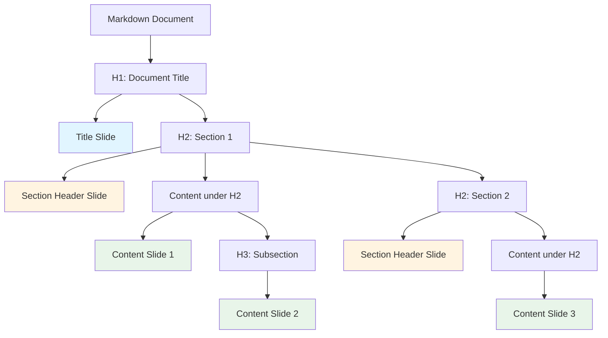

# PowerPoint Conversion Specification

## Overview

This specification defines the complete conversion strategy from Microsoft Copilot-generated markdown to Microsoft PowerPoint (.pptx) format. The conversion transforms markdown's linear document structure into a hierarchical slide presentation, using heading hierarchy to determine slide boundaries and content organization. The specification ensures effective presentation flow, visual hierarchy, and professional slide design.

### Conversion Goals

1. **Slide Structure**: Convert markdown heading hierarchy into logical slide structure
2. **Content Organization**: Organize content into digestible slide-sized chunks
3. **Visual Hierarchy**: Maintain clear visual hierarchy on slides
4. **Professional Design**: Apply consistent, professional slide design
5. **Content Preservation**: Preserve all content while adapting to slide format

### Conversion Approach

The conversion follows a structure-based approach:
1. Parse markdown into AST (as defined in conversion architecture)
2. Analyze heading hierarchy to determine slide boundaries
3. Group content under headings into slides
4. Select appropriate slide layouts based on content type
5. Apply visual styling and formatting
6. Generate final .pptx file

## Slide Structure

### Slide Hierarchy Strategy

Markdown heading hierarchy determines slide structure:



### Slide Mapping Rules

#### H1 (Document Title)

- **Maps to**: Title slide
- **Layout**: Title Slide layout
- **Content**: 
  - Slide title: H1 text
  - Subtitle: Optional (from first paragraph or metadata)
- **Position**: First slide in presentation

#### H2 (Major Sections)

- **Maps to**: Section header slide + content slides
- **Layout**: Section Header layout (or Title and Content)
- **Content**:
  - Section header slide: H2 text as slide title
  - Content slides: All content under H2 until next H2
- **Behavior**: Creates new slide for each H2

#### H3+ (Subsections)

- **Maps to**: Content within slides
- **Layout**: Title and Content layout (if H3 becomes slide title) or content within existing slide
- **Content**:
  - If H3 starts new slide: H3 text as slide title, content below
  - If H3 is within slide: H3 as subsection header within slide content
- **Decision Rule**: 
  - H3 starts new slide if preceding content fills slide
  - Otherwise, H3 becomes subsection within current slide

### Slide Boundary Determination

#### Content Grouping Rules

1. **H2 Boundary**: Each H2 starts a new section with its own slide(s)
2. **Content Under H2**: All content (paragraphs, lists, code, tables, images) under H2 belongs to that section's slides
3. **Slide Splitting**: 
   - Split content across multiple slides if content exceeds slide capacity
   - Split at natural boundaries (after lists, paragraphs, before code blocks)
4. **H3 Handling**: 
   - H3 can start new slide if content is substantial
   - H3 can be subsection header within slide if content is brief

#### Slide Capacity Guidelines

- **Text Content**: ~7-10 bullet points per slide (or equivalent text)
- **Code Blocks**: One code block per slide (may truncate if very long)
- **Tables**: One table per slide (may need simplification for large tables)
- **Images**: 1-2 images per slide (depending on size)
- **Mixed Content**: Combine elements while staying within slide capacity

## Element Mappings

### Headers

Headers determine slide structure and titles.

| Markdown | Slide Element | Layout | Font Size | Font Weight | Position |
|----------|---------------|--------|-----------|-------------|----------|
| H1 (`#`) | Title Slide Title | Title Slide | 44pt | Bold | Center top |
| H2 (`##`) | Slide Title | Title and Content | 32pt | Bold | Top left |
| H3 (`###`) | Slide Subtitle or Content Header | Title and Content | 24pt | Bold | Below title or in content |
| H4 (`####`) | Content Subsection | Content area | 20pt | Bold | In content area |
| H5 (`#####`) | Content Detail | Content area | 18pt | Bold | In content area |
| H6 (`######`) | Content Detail | Content area | 16pt | Bold | In content area |

#### Header Implementation Details

- **H1**: Always creates title slide (first slide)
- **H2**: Creates section header slide, then content slides
- **H3+**: Can create new slide or be content within slide (based on content length)
- **Font**: Segoe UI (or theme font)
- **Color**: Theme color or #323130 (dark gray)

### Paragraphs

Paragraphs become slide body text or bullet points.

| Markdown | Slide Element | Font Size | Font Weight | Formatting |
|----------|---------------|-----------|-------------|------------|
| Paragraph | Body Text | 18pt | Regular | Left-aligned, wrapped |

#### Paragraph Implementation Details

- **Placement**: In content area of slide
- **Formatting**: Left-aligned, wrapped text
- **Spacing**: Consistent line spacing (1.2x)
- **Length**: May be split across slides if long
- **Conversion**: Can be converted to bullet points if appropriate (configurable)

### Lists

Lists are core slide content, converted to bullet points or numbered lists.

#### Unordered Lists

| Markdown | Slide Element | Bullet Style | Font Size | Indentation |
|----------|---------------|--------------|----------|-------------|
| `- item` | Bullet Point | Round bullet (•) | 18pt | 0.5" per level |

#### Ordered Lists

| Markdown | Slide Element | Number Format | Font Size | Indentation |
|----------|---------------|---------------|-----------|-------------|
| `1. item` | Numbered List | Arabic numerals (1, 2, 3...) | 18pt | 0.5" per level |

#### Task Lists (GFM)

| Markdown | Slide Element | Checkbox Style | Font Size |
|----------|---------------|----------------|-----------|
| `- [ ]` (unchecked) | Bullet with Checkbox | ☐ (empty checkbox) | 18pt |
| `- [x]` (checked) | Bullet with Checkbox | ☑ (checked checkbox) | 18pt |

#### List Implementation Details

- **Bullet Points**: Primary content format for slides
- **Nesting**: Preserve list nesting with indentation (0.5" per level)
- **Font**: Segoe UI, 18pt
- **Spacing**: Consistent spacing between items
- **Maximum Items**: ~7-10 bullet points per slide (split if more)
- **Task Lists**: Use checkbox symbols (☐/☑) or Unicode characters

### Links

Links become clickable hyperlinks on slides.

| Markdown | Slide Element | Display | Target | Style |
|----------|---------------|---------|--------|-------|
| `[text](url)` | Hyperlink | Link text | URL | Blue, underlined |
| `[text][ref]` | Hyperlink | Link text | Resolved URL | Blue, underlined |
| `<url>` | Hyperlink | URL | URL | Blue, underlined |

#### Link Implementation Details

- **Hyperlinks**: Clickable hyperlinks in PowerPoint
- **Display Text**: Show link text, not raw URL (unless autolink)
- **Styling**: Blue color (#0078D4), underlined
- **Placement**: Inline with text
- **URL Resolution**: Resolve reference links to actual URLs

### Images

Images are embedded on slides with appropriate sizing and placement.

| Markdown | Slide Element | Placement | Sizing | Alt Text |
|----------|---------------|-----------|--------|----------|
| `` | Slide Image | Content area | Fit to slide width | Preserved |

#### Image Implementation Details

- **Embedding**: Embed images directly in PowerPoint
- **Placement**: 
  - In content area (default)
  - Can be full-slide background (if specified)
  - Can be alongside text (two-content layout)
- **Sizing**: 
  - Default: Fit to slide width (max 9.5" width)
  - Preserve aspect ratio
  - Scale down if too large
- **Format Support**: PNG, JPEG, GIF (SVG converted to PNG)
- **Alt Text**: Preserve for accessibility
- **Path Resolution**: Resolve relative paths relative to markdown file

#### Image Placement Strategies

1. **Single Image**: Center or left-align in content area
2. **Image + Text**: Use two-content layout
3. **Full Slide Image**: Use content with caption layout
4. **Multiple Images**: Arrange in grid (if multiple images in section)

### Code Blocks

Code blocks require special handling due to space constraints on slides.

#### Fenced Code Blocks

| Markdown | Slide Element | Font | Background | Border | Sizing |
|----------|---------------|------|------------|--------|--------|
| ` ```lang` | Text Box with Code | Consolas, 10pt | Light gray (#F5F5F5) | Optional border | Fit to slide |

#### Inline Code

| Markdown | Slide Element | Font | Background |
|----------|---------------|------|------------|
| `` `code` `` | Formatted Text | Consolas, 10pt | Light gray (#F5F5F5) |

#### Code Block Implementation Details

- **Font**: Monospace font (Consolas, Courier New, or Lucida Console)
- **Font Size**: 10pt (smaller for readability on slides)
- **Background**: Light gray (#F5F5F5)
- **Border**: Optional 1pt border (#CCCCCC)
- **Placement**: In text box within content area
- **Sizing**: Fit to slide width, preserve aspect ratio
- **Long Code**: 
  - Option 1: Truncate with ellipsis (...)
  - Option 2: Split across multiple slides
  - Option 3: Use scrolling text box (if supported)
- **Language Identifier**: Preserve in comment or slide notes

### Tables

Tables are embedded on slides with formatting and sizing.

| Markdown | Slide Element | Borders | Header Row | Sizing |
|----------|---------------|---------|------------|--------|
| Pipe table | PowerPoint Table | Yes (1pt solid) | Bold, shaded | Fit to slide |

#### Table Implementation Details

- **Table Object**: Use PowerPoint table object
- **Borders**: 1pt solid borders (#000000)
- **Header Row**: 
  - Bold font weight
  - Light background shading (#F2F2F2)
- **Column Alignment**: Preserve markdown alignment (left, center, right)
- **Sizing**: 
  - Fit to slide width
  - Auto-fit columns or equal width
  - Scale down if too wide
- **Large Tables**: 
  - Simplify for slide presentation
  - Show key columns/rows
  - Split across multiple slides if necessary

### Blockquotes

Blockquotes are formatted text boxes with emphasis.

| Markdown | Slide Element | Indentation | Border | Background | Font Style |
|----------|---------------|-------------|--------|------------|------------|
| `> text` | Text Box | Left indent | Left border (optional) | Light background (optional) | Italic (optional) |

#### Blockquote Implementation Details

- **Placement**: In content area as formatted text box
- **Indentation**: Left indent 0.5"
- **Border**: Optional left border (3pt solid #CCCCCC)
- **Background**: Optional light background (#FAFAFA)
- **Font Style**: Optional italic
- **Spacing**: Consistent spacing before and after

### Horizontal Rules

Horizontal rules can create slide separators or new slides.

| Markdown | Slide Element | Behavior |
|----------|---------------|----------|
| `---` | Slide Separator | New slide (optional) or visual separator |

#### Horizontal Rule Implementation Details

- **Default**: Create new slide (section break)
- **Alternative**: Visual separator line on slide
- **Styling**: 2pt solid line (#CCCCCC)
- **Placement**: Full width of slide

### Strikethrough (GFM)

Strikethrough text is formatted with strikethrough style.

| Markdown | Slide Element | Font Style |
|----------|---------------|------------|
| `~~text~~` | Strikethrough Text | Single strikethrough line |

#### Strikethrough Implementation Details

- **Character Formatting**: Apply strikethrough at character level
- **Style**: Single strikethrough line
- **Color**: Same as text or gray (#808080)

## Layout Strategy

### Slide Layout Selection

PowerPoint provides various slide layouts. Selection is based on content type:

#### Title Slide Layout

- **Used for**: H1 (document title)
- **Layout**: Title Slide
- **Elements**:
  - Title placeholder: H1 text
  - Subtitle placeholder: Optional (first paragraph or metadata)

#### Title and Content Layout

- **Used for**: H2 sections, H3 subsections
- **Layout**: Title and Content
- **Elements**:
  - Title placeholder: H2 or H3 text
  - Content placeholder: Lists, paragraphs, code, tables, images

#### Two Content Layout

- **Used for**: Content with side-by-side elements
- **Layout**: Two Content
- **Elements**:
  - Left: Text or list
  - Right: Image or table
  - Or: Two columns of content

#### Content with Caption Layout

- **Used for**: Image-focused slides
- **Layout**: Content with Caption
- **Elements**:
  - Large image
  - Caption below image

#### Blank Layout

- **Used for**: Custom arrangements
- **Layout**: Blank
- **Elements**: Manually positioned elements

### Layout Selection Rules

1. **H1**: Always Title Slide layout
2. **H2**: Title and Content layout (section header slide)
3. **Content Slides**: 
   - Title and Content (default)
   - Two Content (if image + text)
   - Content with Caption (if large image)
4. **Code-Heavy Slides**: Title and Content with formatted code box
5. **Table-Heavy Slides**: Title and Content with table

### Content Splitting Strategy

When content exceeds slide capacity:

1. **Lists**: Split at natural boundaries (after 7-10 items)
2. **Paragraphs**: Split at paragraph boundaries
3. **Code Blocks**: 
   - Option 1: Truncate with ellipsis
   - Option 2: Split across slides with continuation indicator
4. **Tables**: Simplify or split across slides
5. **Mixed Content**: Split at natural section boundaries

## Visual Design

### Color Scheme

Professional color scheme for slides:

#### Primary Colors

- **Primary Blue**: #0078D4 (Microsoft blue)
- **Secondary Blue**: #00BCF2 (light blue)
- **Accent**: #107C10 (green) for emphasis

#### Text Colors

- **Primary Text**: #323130 (dark gray)
- **Secondary Text**: #605E5C (medium gray)
- **Link Color**: #0078D4 (blue)

#### Background Colors

- **Slide Background**: White (#FFFFFF)
- **Content Background**: White (#FFFFFF)
- **Code Background**: #F5F5F5 (light gray)
- **Table Header Background**: #F2F2F2 (light gray)

### Font Specifications

#### Title Fonts

- **Slide Title**: Segoe UI, 32pt, Bold, #323130
- **Title Slide Title**: Segoe UI, 44pt, Bold, #0078D4
- **Subtitle**: Segoe UI, 24pt, Regular, #605E5C

#### Body Fonts

- **Body Text**: Segoe UI, 18pt, Regular, #323130
- **Bullet Points**: Segoe UI, 18pt, Regular, #323130
- **Code**: Consolas, 10pt, Regular, #323130
- **Inline Code**: Consolas, 10pt, Regular, #323130

#### Font Hierarchy

- H1 (Title Slide): 44pt
- H2 (Slide Title): 32pt
- H3 (Subsection): 24pt
- Body Text: 18pt
- Code: 10pt

### Spacing and Layout

#### Slide Margins

- **Top Margin**: 0.5"
- **Bottom Margin**: 0.5"
- **Left Margin**: 0.75"
- **Right Margin**: 0.75"

#### Content Spacing

- **Between Bullet Points**: 0.15" (12pt)
- **Between Paragraphs**: 0.2" (16pt)
- **Before Headings**: 0.25" (20pt)
- **After Headings**: 0.15" (12pt)

#### Indentation

- **List Indentation**: 0.5" per nesting level
- **Blockquote Indentation**: 0.5" left indent
- **Code Block Padding**: 0.25" all sides

### Visual Elements

#### Bullet Points

- **Style**: Round bullet (•)
- **Size**: 12pt
- **Color**: #323130 (matches text)
- **Spacing**: 0.15" between items

#### Borders and Lines

- **Code Block Border**: 1pt solid #CCCCCC (optional)
- **Table Borders**: 1pt solid #000000
- **Blockquote Border**: 3pt solid #CCCCCC (left border, optional)
- **Horizontal Rule**: 2pt solid #CCCCCC

#### Shadows and Effects

- **Minimal Use**: Avoid excessive shadows or effects
- **Code Blocks**: Optional subtle shadow for depth
- **Images**: Optional border or shadow for emphasis

## Slide Theme

### Theme Design

Apply consistent theme across all slides:

1. **Master Slide**: Define slide master with consistent styling
2. **Layouts**: Customize layouts for different content types
3. **Color Scheme**: Apply color scheme consistently
4. **Fonts**: Use theme fonts throughout

### Theme Elements

- **Background**: White with optional subtle pattern
- **Title Area**: Consistent styling for all slide titles
- **Content Area**: Consistent spacing and formatting
- **Footer**: Optional slide number and date

## Implementation Notes

### PowerPoint Document Generation

#### Technology Stack Options

1. **JavaScript/TypeScript**:
   - Library: `pptxgenjs` (npm package)
   - Pros: Cross-platform, good API
   - Cons: May have limitations for advanced features

2. **Python**:
   - Library: `python-pptx`
   - Pros: Mature, feature-rich
   - Cons: Requires Python runtime

3. **C#/.NET**:
   - Library: OpenXML SDK
   - Pros: Native PowerPoint support, full feature set
   - Cons: Windows-focused (though .NET Core is cross-platform)

#### Document Generation Process

1. **Create Presentation**: Initialize PowerPoint presentation object
2. **Set Theme**: Apply slide theme and master
3. **Process AST**: Iterate through AST nodes
4. **Determine Slides**: Group content into slides based on heading hierarchy
5. **Select Layouts**: Choose appropriate layout for each slide
6. **Add Content**: Add text, images, tables, code to slides
7. **Apply Styling**: Apply fonts, colors, and formatting
8. **Generate File**: Write .pptx file

#### Key Implementation Considerations

- **Slide Creation**: Create slides based on H2 boundaries
- **Content Grouping**: Group content under headings into slides
- **Layout Selection**: Choose layouts based on content type
- **Content Splitting**: Split long content across multiple slides
- **Image Embedding**: Embed images as binary data in presentation
- **Table Creation**: Use PowerPoint table objects
- **Code Formatting**: Format code blocks with monospace font and background

### Error Handling

- **Missing Images**: Log warning, use placeholder or skip
- **Broken Links**: Preserve link text, mark as broken
- **Malformed Tables**: Attempt to parse, fallback to text
- **Long Code Blocks**: Truncate or split across slides
- **Parse Errors**: Report error location, continue with partial conversion

### Performance Considerations

- **Large Documents**: Process in chunks if needed
- **Image Optimization**: Optimize images before embedding
- **Slide Count**: Handle presentations with many slides
- **Memory Management**: Stream processing for very large documents

### Testing Priorities

1. **Slide Structure**: Test heading hierarchy to slide mapping
2. **Content Splitting**: Test content splitting across slides
3. **Layout Selection**: Test layout selection for different content types
4. **All Elements**: Test each markdown element on slides
5. **Edge Cases**: Test malformed content, missing resources
6. **Large Documents**: Test with large markdown files
7. **Visual Design**: Verify visual design matches specification

## Conclusion

This PowerPoint conversion specification provides comprehensive mappings from markdown elements to PowerPoint slide structures. The specification ensures effective presentation flow, professional slide design, and content preservation. Implementation should follow these mappings to create high-quality PowerPoint presentations from markdown source files.

