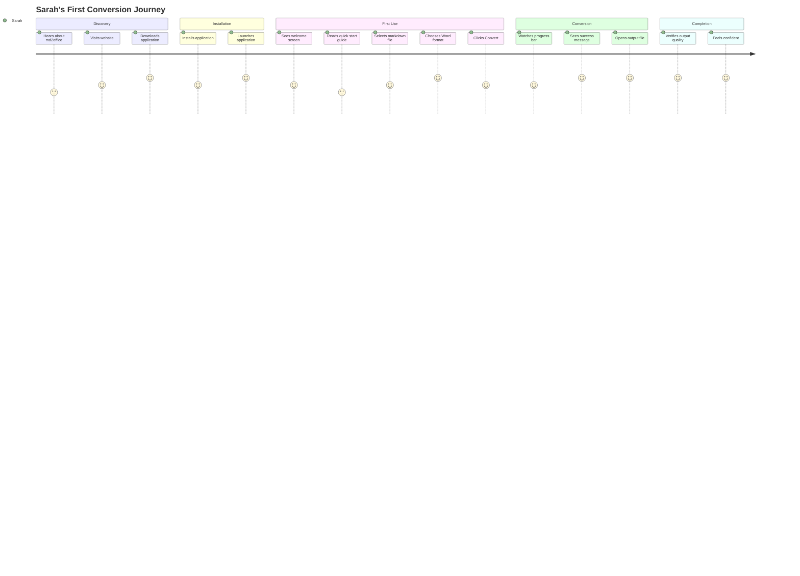
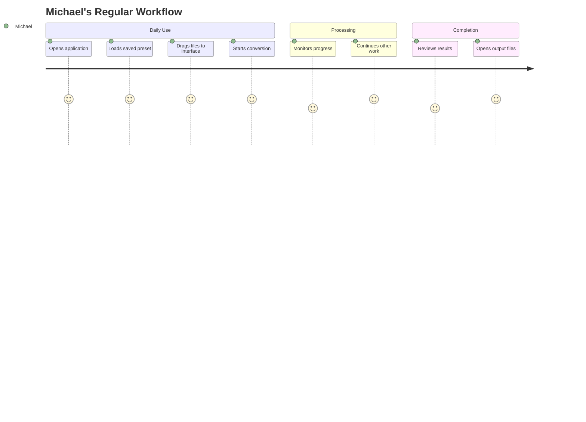
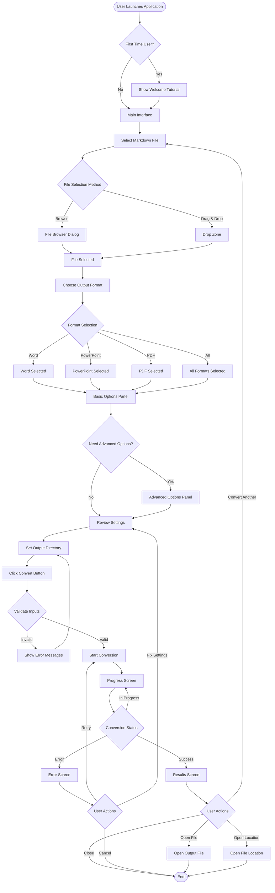
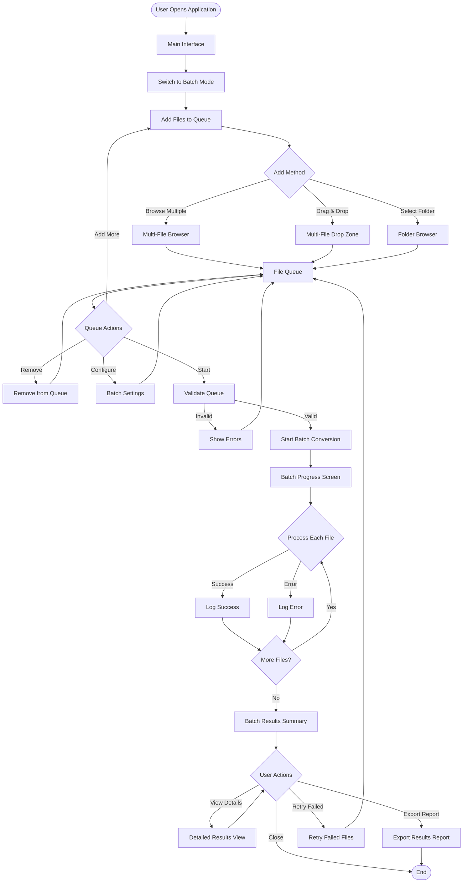
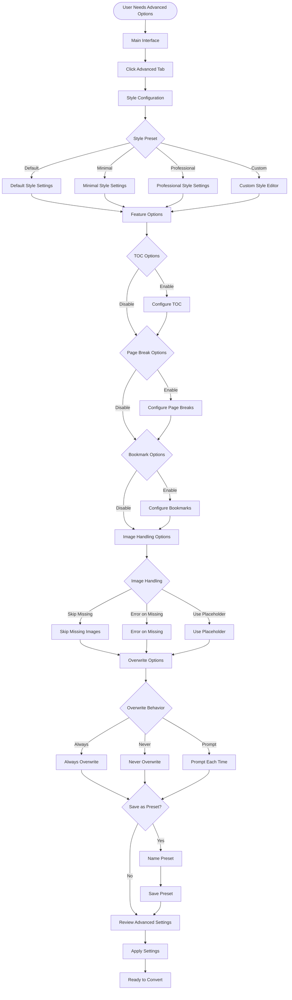

# UX Design Documentation - md2office Front-End Interface

## Executive Summary

This document provides comprehensive UX design documentation for the md2office front-end interface. The design approach prioritizes user-centered principles, accessibility, and efficiency while maintaining the power and flexibility of the underlying CLI tool. The interface will serve multiple user personas—from first-time users needing guidance to power users requiring advanced configuration options.

**Design Philosophy**: Create an intuitive, accessible graphical interface that makes document conversion simple while preserving all CLI capabilities. The design emphasizes progressive disclosure, clear feedback, and efficient workflows for both single-file and batch processing scenarios.

**Key Design Decisions**:
- Single-window application with tabbed interface for different configuration levels
- Drag-and-drop file selection for improved usability
- Real-time preview of conversion settings before execution
- Clear progress indication and result feedback
- Keyboard-first navigation for accessibility
- Native look-and-feel on each platform

---

## 1. User Personas

### Persona 1: Sarah - The First-Time User
**Demographics**: 
- Age: 28
- Role: Marketing Coordinator
- Location: Urban, USA
- Technical Proficiency: Low-Medium

**Goals and Motivations**:
- Convert Copilot-generated markdown reports to Word documents for client presentations
- Learn the tool quickly without reading extensive documentation
- Produce professional-looking documents without technical knowledge

**Pain Points**:
- Intimidated by command-line interfaces
- Unfamiliar with markdown and conversion tools
- Needs visual guidance and clear instructions
- Worried about making mistakes or losing files

**Preferred Interaction Methods**: 
- GUI with clear visual feedback
- Tooltips and inline help
- Step-by-step wizards for first use

**Key Needs**:
- Simple, guided workflow
- Clear visual feedback
- Error messages in plain language
- Ability to undo or cancel operations

---

### Persona 2: Michael - The Regular User
**Demographics**:
- Age: 35
- Role: Technical Writer
- Location: Suburban, USA
- Technical Proficiency: Medium-High

**Goals and Motivations**:
- Convert multiple markdown files to Word/PDF formats weekly
- Maintain consistent formatting across documents
- Batch process files efficiently
- Save time with quick workflows

**Pain Points**:
- Repetitive tasks take too long
- Need to remember command-line options
- Wants to reuse settings across conversions
- Needs to process multiple files quickly

**Preferred Interaction Methods**:
- GUI with keyboard shortcuts
- Saved presets/profiles
- Batch processing interface
- Quick access to frequently used options

**Key Needs**:
- Fast, efficient workflow
- Saved configuration profiles
- Batch processing capabilities
- Keyboard shortcuts for power users

---

### Persona 3: Dr. Chen - The Power User
**Demographics**:
- Age: 42
- Role: Research Scientist
- Location: Urban, International
- Technical Proficiency: High

**Goals and Motivations**:
- Convert complex technical documents with advanced formatting
- Customize output styles for different publication requirements
- Automate conversion workflows
- Access all advanced features

**Pain Points**:
- GUI limitations hiding advanced options
- Need for precise control over conversion parameters
- Integration with other tools/workflows
- Performance with large documents

**Preferred Interaction Methods**:
- GUI with advanced options panel
- Configuration file support
- CLI integration when needed
- Scriptable workflows

**Key Needs**:
- Access to all configuration options
- Advanced styling controls
- Configuration file management
- Performance optimization options

---

### Persona 4: Lisa - The Batch Processor
**Demographics**:
- Age: 31
- Role: Documentation Manager
- Location: Urban, USA
- Technical Proficiency: Medium

**Goals and Motivations**:
- Convert entire directories of markdown files
- Process hundreds of files at once
- Monitor progress and handle errors efficiently
- Generate reports on conversion results

**Pain Points**:
- Processing many files individually is tedious
- Need to track which files succeeded/failed
- Long-running operations need progress visibility
- Error handling for multiple files

**Preferred Interaction Methods**:
- GUI with batch processing interface
- Progress monitoring and logging
- Queue management
- Results summary and reporting

**Key Needs**:
- Drag-and-drop multiple files/folders
- Queue management interface
- Progress tracking for batch operations
- Detailed results summary

---

### Persona 5: James - The Accessibility-Focused User
**Demographics**:
- Age: 38
- Role: Content Creator
- Location: Urban, USA
- Technical Proficiency: Medium
- Accessibility Needs: Visual impairment, uses screen reader

**Goals and Motivations**:
- Use the application entirely with keyboard navigation
- Understand all interface elements through screen reader
- Convert documents independently
- Access all features without mouse dependency

**Pain Points**:
- Many GUI applications lack proper keyboard navigation
- Screen reader compatibility issues
- Unclear focus indicators
- Missing ARIA labels and descriptions

**Preferred Interaction Methods**:
- Full keyboard navigation
- Screen reader compatible interface
- Clear focus indicators
- Audio feedback for actions

**Key Needs**:
- Complete keyboard accessibility
- Screen reader support (NVDA, JAWS, VoiceOver)
- High contrast mode
- Clear focus indicators
- Descriptive labels for all controls

---

## 2. User Journey Maps

### Journey 1: Sarah's First Conversion (First-Time User)



**Detailed Journey Stages**:

**Stage 1: Discovery**
- **Action**: Sarah learns about md2office from a colleague
- **Thought**: "I need to convert markdown files but don't know how to use command line"
- **Emotion**: Hopeful but anxious
- **Touchpoint**: Website, documentation
- **Opportunity**: Clear value proposition, GUI availability highlighted
- **Pain Point**: Uncertainty about technical requirements

**Stage 2: Installation**
- **Action**: Downloads and installs the application
- **Thought**: "I hope installation is straightforward"
- **Emotion**: Cautiously optimistic
- **Touchpoint**: Installer, first launch
- **Opportunity**: Welcome wizard, first-run tutorial
- **Pain Point**: Installation complexity, unclear next steps

**Stage 3: First Use**
- **Action**: Opens application, sees interface
- **Thought**: "This looks simpler than I expected"
- **Emotion**: Relieved, curious
- **Touchpoint**: Main interface, file picker
- **Opportunity**: Tooltips, inline help, example files
- **Pain Point**: Too many options visible at once

**Stage 4: Conversion**
- **Action**: Selects file, chooses format, clicks Convert
- **Thought**: "I hope this works correctly"
- **Emotion**: Anxious, hopeful
- **Touchpoint**: Progress indicator, status messages
- **Opportunity**: Clear progress feedback, estimated time
- **Pain Point**: Uncertainty during conversion, no progress visibility

**Stage 5: Completion**
- **Action**: Reviews output file
- **Thought**: "Perfect! This is exactly what I needed"
- **Emotion**: Satisfied, confident
- **Touchpoint**: Results screen, file explorer
- **Opportunity**: "Open file location" button, quality preview
- **Pain Point**: Finding output file location

---

### Journey 2: Michael's Regular Workflow (Regular User)



**Key Touchpoints**:
- Quick access to saved presets
- Drag-and-drop file selection
- Background processing with notifications
- Results summary with quick actions

---

## 3. User Flow Diagrams

### Flow 1: Basic Single File Conversion



### Flow 2: Batch Processing



### Flow 3: Advanced Configuration



---

## 4. Information Architecture

### Application Structure

```
md2office GUI Application
│
├── Main Window
│   ├── Menu Bar
│   │   ├── File Menu
│   │   │   ├── New Conversion
│   │   │   ├── Open Configuration
│   │   │   ├── Save Configuration
│   │   │   ├── Recent Files
│   │   │   ├── Exit
│   │   ├── Edit Menu
│   │   │   ├── Preferences
│   │   │   ├── Presets Manager
│   │   ├── View Menu
│   │   │   ├── Basic Mode
│   │   │   ├── Advanced Mode
│   │   │   ├── Batch Mode
│   │   │   ├── Show Toolbar
│   │   │   ├── Show Status Bar
│   │   ├── Tools Menu
│   │   │   ├── Validate Markdown
│   │   │   ├── Preview Output
│   │   │   ├── Check for Updates
│   │   ├── Help Menu
│   │   │   ├── User Guide
│   │   │   ├── Keyboard Shortcuts
│   │   │   ├── About
│   │
│   ├── Toolbar (Optional)
│   │   ├── New Conversion Button
│   │   ├── Open File Button
│   │   ├── Quick Convert Button
│   │   ├── Presets Dropdown
│   │   ├── Settings Button
│   │
│   ├── Content Area
│   │   ├── Tab 1: Basic Conversion
│   │   │   ├── File Selection Section
│   │   │   ├── Format Selection Section
│   │   │   ├── Output Directory Section
│   │   │   ├── Basic Options Section
│   │   │   └── Action Buttons
│   │   │
│   │   ├── Tab 2: Advanced Options
│   │   │   ├── Style Configuration
│   │   │   ├── Feature Options
│   │   │   ├── Image Handling
│   │   │   ├── Overwrite Behavior
│   │   │   └── Preset Management
│   │   │
│   │   ├── Tab 3: Batch Processing
│   │   │   ├── File Queue
│   │   │   ├── Batch Settings
│   │   │   ├── Progress Monitor
│   │   │   └── Results Summary
│   │
│   ├── Status Bar
│   │   ├── Ready Status
│   │   ├── File Count
│   │   ├── Selected Format
│   │   └── Progress Indicator (when active)
│
├── Dialogs
│   ├── Welcome Dialog (First Launch)
│   ├── File Browser Dialog
│   ├── Folder Browser Dialog
│   ├── Settings Dialog
│   ├── Presets Manager Dialog
│   ├── Progress Dialog
│   ├── Results Dialog
│   ├── Error Dialog
│   └── About Dialog
```

### Navigation Hierarchy

```
Level 1: Main Window
    ├── Level 2: Menu Bar (Global Navigation)
    ├── Level 2: Toolbar (Quick Actions)
    ├── Level 2: Content Tabs (Mode Selection)
    │   ├── Level 3: Basic Conversion Panel
    │   ├── Level 3: Advanced Options Panel
    │   └── Level 3: Batch Processing Panel
    └── Level 2: Status Bar (Information Display)

Level 1: Modal Dialogs
    ├── Level 2: File Selection Dialogs
    ├── Level 2: Configuration Dialogs
    ├── Level 2: Progress Dialogs
    └── Level 2: Results Dialogs
```

### Content Organization Principles

1. **Progressive Disclosure**: Basic options visible by default, advanced options in separate tab
2. **Contextual Grouping**: Related options grouped together (format options, style options, etc.)
3. **Visual Hierarchy**: Most important actions (Convert button) prominently displayed
4. **Consistent Layout**: Similar controls in consistent locations across tabs
5. **Clear Labels**: All controls have descriptive labels and tooltips

---

## 5. ASCII Wireframes

### Wireframe 1: Main Interface - Basic Conversion Tab

```
┌─────────────────────────────────────────────────────────────────────────────┐
│ md2office                                    [─] [□] [×]                    │
├─────────────────────────────────────────────────────────────────────────────┤
│ File  Edit  View  Tools  Help                                               │
├─────────────────────────────────────────────────────────────────────────────┤
│ [New] [Open] [Quick Convert ▼] [Presets ▼] [⚙ Settings]                    │
├─────────────────────────────────────────────────────────────────────────────┤
│                                                                             │
│ ┌───────────────────────────────────────────────────────────────────────┐ │
│ │ [Basic]  [Advanced]  [Batch]                                         │ │
│ ├───────────────────────────────────────────────────────────────────────┤ │
│ │                                                                       │ │
│ │  Input File                                                           │ │
│ │  ┌─────────────────────────────────────────────────────────────┐     │ │
│ │  │ C:\Users\Sarah\Documents\report.md                          │     │ │
│ │  └─────────────────────────────────────────────────────────────┘     │ │
│ │  [Browse...]  [Clear]                                                │ │
│ │                                                                       │ │
│ │  ────────────────────────────────────────────────────────────────    │ │
│ │                                                                       │ │
│ │  Output Formats                                                       │ │
│ │  ┌─────────────────────────────────────────────────────────────┐     │ │
│ │  │ ☑ Word (.docx)                                              │ │
│ │  │ ☐ PowerPoint (.pptx)                                        │ │
│ │  │ ☐ PDF                                                        │ │
│ │  │ ☐ All Formats                                                │ │
│ │  └─────────────────────────────────────────────────────────────┘     │ │
│ │                                                                       │ │
│ │  ────────────────────────────────────────────────────────────────    │ │
│ │                                                                       │ │
│ │  Output Directory                                                     │ │
│ │  ┌─────────────────────────────────────────────────────────────┐     │ │
│ │  │ C:\Users\Sarah\Documents\output                             │ │
│ │  └─────────────────────────────────────────────────────────────┘     │ │
│ │  [Browse...]  [Use Same as Input]                                   │ │
│ │                                                                       │ │
│ │  ────────────────────────────────────────────────────────────────    │ │
│ │                                                                       │ │
│ │  Basic Options                                                        │ │
│ │  ┌─────────────────────────────────────────────────────────────┐     │ │
│ │  │ ☐ Table of Contents                                         │ │
│ │  │ ☐ Page Breaks                                               │ │
│ │  │ ☐ Bookmarks (PDF only)                                      │ │
│ │  │ ☐ Skip Missing Images                                       │ │
│ │  └─────────────────────────────────────────────────────────────┘     │ │
│ │                                                                       │ │
│ │  Style Preset: [Default ▼]                                           │ │
│ │                                                                       │ │
│ │  ────────────────────────────────────────────────────────────────    │ │
│ │                                                                       │ │
│ │                                    [Advanced Options >>]              │ │
│ │                                                                       │ │
│ │                                    [Convert]  [Cancel]                │ │
│ │                                                                       │ │
│ └───────────────────────────────────────────────────────────────────────┘ │
│                                                                             │
├─────────────────────────────────────────────────────────────────────────────┤
│ Ready  |  Files: 1  |  Format: Word  |  [Progress: ░░░░░░░░░░ 0%]        │
└─────────────────────────────────────────────────────────────────────────────┘
```

### Wireframe 2: Advanced Options Tab

```
┌─────────────────────────────────────────────────────────────────────────────┐
│ md2office                                    [─] [□] [×]                    │
├─────────────────────────────────────────────────────────────────────────────┤
│ File  Edit  View  Tools  Help                                               │
├─────────────────────────────────────────────────────────────────────────────┤
│ [New] [Open] [Quick Convert ▼] [Presets ▼] [⚙ Settings]                    │
├─────────────────────────────────────────────────────────────────────────────┤
│                                                                             │
│ ┌───────────────────────────────────────────────────────────────────────┐ │
│ │ [Basic]  [Advanced]  [Batch]                                         │ │
│ ├───────────────────────────────────────────────────────────────────────┤ │
│ │                                                                       │ │
│ │  Style Configuration                                                  │ │
│ │  ┌─────────────────────────────────────────────────────────────┐     │ │
│ │  │ Preset: [Default ▼]  [Edit]  [Save As...]                   │ │
│ │  │                                                             │ │
│ │  │ Font Family: [Calibri ▼]                                   │ │
│ │  │ Font Size: [11] pt                                          │ │
│ │  │ Heading Style: [Bold]  [Italic]  [Underline]               │ │
│ │  │ Color Scheme: [Professional ▼]                             │ │
│ │  └─────────────────────────────────────────────────────────────┘     │ │
│ │                                                                       │ │
│ │  ────────────────────────────────────────────────────────────────    │ │
│ │                                                                       │ │
│ │  Feature Options                                                     │ │
│ │  ┌─────────────────────────────────────────────────────────────┐     │ │
│ │  │ Table of Contents                                            │ │
│ │  │   ☑ Enable TOC                                               │ │
│ │  │   Depth: [3] levels                                          │ │
│ │  │   Position: [Beginning ▼]                                    │ │
│ │  │                                                             │ │
│ │  │ Page Breaks                                                  │ │
│ │  │   ☑ Insert page breaks at major sections                    │ │
│ │  │   Break at: [H1 and H2 ▼]                                   │ │
│ │  │                                                             │ │
│ │  │ Bookmarks (PDF)                                              │ │
│ │  │   ☑ Generate bookmarks                                       │ │
│ │  │   Include: [All Headings ▼]                                 │ │
│ │  └─────────────────────────────────────────────────────────────┘     │ │
│ │                                                                       │ │
│ │  ────────────────────────────────────────────────────────────────    │ │
│ │                                                                       │ │
│ │  Image Handling                                                       │ │
│ │  ┌─────────────────────────────────────────────────────────────┐     │ │
│ │  │ Missing Images: [Skip Missing ▼]                            │ │
│ │  │   Options: Skip Missing | Error on Missing | Use Placeholder│ │
│ │  │                                                             │ │
│ │  │ Image Optimization: ☐ Resize large images                   │ │
│ │  │   Max Width: [800] px                                       │ │
│ │  └─────────────────────────────────────────────────────────────┘     │ │
│ │                                                                       │ │
│ │  ────────────────────────────────────────────────────────────────    │ │
│ │                                                                       │ │
│ │  File Handling                                                       │ │
│ │  ┌─────────────────────────────────────────────────────────────┐     │ │
│ │  │ Overwrite Behavior: [Prompt Each Time ▼]                    │ │
│ │  │   Options: Always | Never | Prompt Each Time                │ │
│ │  │                                                             │ │
│ │  │ Output Filename:                                            │ │
│ │  │   ☐ Use original name                                       │ │
│ │  │   Custom: [________________]                                 │ │
│ │  │   Suffix: [________________]                                │ │
│ │  └─────────────────────────────────────────────────────────────┘     │ │
│ │                                                                       │ │
│ │  ────────────────────────────────────────────────────────────────    │ │
│ │                                                                       │ │
│ │  [Save as Preset...]  [Reset to Defaults]                            │ │
│ │                                                                       │ │
│ │                                    [<< Basic Options]  [Convert]     │ │
│ │                                                                       │ │
│ └───────────────────────────────────────────────────────────────────────┘ │
│                                                                             │
├─────────────────────────────────────────────────────────────────────────────┤
│ Ready  |  Files: 1  |  Format: Word  |  Advanced Mode                      │
└─────────────────────────────────────────────────────────────────────────────┘
```

### Wireframe 3: Batch Processing Tab

```
┌─────────────────────────────────────────────────────────────────────────────┐
│ md2office                                    [─] [□] [×]                    │
├─────────────────────────────────────────────────────────────────────────────┤
│ File  Edit  View  Tools  Help                                               │
├─────────────────────────────────────────────────────────────────────────────┤
│ [New] [Open] [Quick Convert ▼] [Presets ▼] [⚙ Settings]                    │
├─────────────────────────────────────────────────────────────────────────────┤
│                                                                             │
│ ┌───────────────────────────────────────────────────────────────────────┐ │
│ │ [Basic]  [Advanced]  [Batch]                                         │ │
│ ├───────────────────────────────────────────────────────────────────────┤ │
│ │                                                                       │ │
│ │  File Queue                                                           │ │
│ │  ┌─────────────────────────────────────────────────────────────┐     │ │
│ │  │ [+ Add Files]  [+ Add Folder]  [Clear All]  [Remove Selected]│ │
│ │  ├─────────────────────────────────────────────────────────────┤ │
│ │  │ ☑ │ File Name                    │ Format │ Status          │ │
│ │  ├───┼──────────────────────────────┼────────┼─────────────────┤ │
│ │  │ ☑ │ report1.md                   │ All    │ Pending         │ │
│ │  │ ☑ │ report2.md                   │ Word   │ Pending         │ │
│ │  │ ☑ │ presentation.md               │ PPT    │ Pending         │ │
│ │  │ ☐ │ old_report.md                 │ PDF    │ Pending         │ │
│ │  └─────────────────────────────────────────────────────────────┘     │ │
│ │  Total: 3 files selected                                             │ │
│ │                                                                       │ │
│ │  ────────────────────────────────────────────────────────────────    │ │
│ │                                                                       │ │
│ │  Batch Settings                                                       │ │
│ │  ┌─────────────────────────────────────────────────────────────┐     │ │
│ │  │ Output Directory: [C:\Users\Michael\output] [Browse...]    │ │
│ │  │                                                             │ │
│ │  │ Default Format: [Word ▼]                                    │ │
│ │  │   Apply to: [All Files ▼]                                  │ │
│ │  │                                                             │ │
│ │  │ Options:                                                     │ │
│ │  │   ☑ Table of Contents                                        │ │
│ │  │   ☐ Page Breaks                                              │ │
│ │  │   ☑ Skip Missing Images                                      │ │
│ │  │                                                             │ │
│ │  │ Style Preset: [Professional ▼]                              │ │
│ │  └─────────────────────────────────────────────────────────────┘     │ │
│ │                                                                       │ │
│ │  ────────────────────────────────────────────────────────────────    │ │
│ │                                                                       │ │
│ │  Progress                                                             │ │
│ │  ┌─────────────────────────────────────────────────────────────┐     │ │
│ │  │ Overall Progress: ████████░░ 80%                           │ │
│ │  │                                                             │ │
│ │  │ Current File: report2.md                                    │ │
│ │  │ File Progress: ████████████ 100%                           │ │
│ │  │                                                             │ │
│ │  │ Completed: 2/3 files                                        │ │
│ │  │ Remaining: ~30 seconds                                      │ │
│ │  └─────────────────────────────────────────────────────────────┘     │ │
│ │                                                                       │ │
│ │                                    [Start Batch]  [Pause]  [Cancel]  │ │
│ │                                                                       │ │
│ └───────────────────────────────────────────────────────────────────────┘ │
│                                                                             │
├─────────────────────────────────────────────────────────────────────────────┤
│ Processing...  |  Files: 3  |  Completed: 2/3  |  [Progress: ████░░░░░░] │
└─────────────────────────────────────────────────────────────────────────────┘
```

### Wireframe 4: Progress Dialog

```
┌─────────────────────────────────────────────────────────────────────────────┐
│ Conversion Progress                                          [×]            │
├─────────────────────────────────────────────────────────────────────────────┤
│                                                                             │
│  Converting: report.md                                                      │
│  Format: Word (.docx)                                                       │
│                                                                             │
│  ┌─────────────────────────────────────────────────────────────────────┐ │
│  │                                                                     │ │
│  │  Overall Progress                                                    │ │
│  │  ████████████████████░░░░░░░░░░░░░░░░░░░░░░░░░░░░░░░░░░░░░░░░░░░░  │ │
│  │  45%                                                                 │ │
│  │                                                                     │ │
│  │  Current Step: Processing images...                                  │ │
│  │  Step Progress: ████████░░░░░░░░░░░░░░░░░░░░░░░░░░░░░░░░░░░░░░░░  │ │
│  │  30%                                                                 │ │
│  │                                                                     │ │
│  │  Estimated time remaining: ~1 minute 30 seconds                     │ │
│  │                                                                     │ │
│  └─────────────────────────────────────────────────────────────────────┘ │
│                                                                             │
│  [Cancel]                                                                   │
│                                                                             │
└─────────────────────────────────────────────────────────────────────────────┘
```

### Wireframe 5: Results Dialog

```
┌─────────────────────────────────────────────────────────────────────────────┐
│ Conversion Complete                                          [×]            │
├─────────────────────────────────────────────────────────────────────────────┤
│                                                                             │
│  ✓ Conversion successful!                                                  │
│                                                                             │
│  Input File: report.md                                                      │
│  Output Files:                                                              │
│    • report.docx (Word)                                                     │
│    • report.pptx (PowerPoint)                                               │
│    • report.pdf (PDF)                                                       │
│                                                                             │
│  Output Location: C:\Users\Sarah\Documents\output                           │
│                                                                             │
│  ┌─────────────────────────────────────────────────────────────────────┐ │
│  │                                                                     │ │
│  │  [Open File Location]  [Open Word]  [Open PowerPoint]  [Open PDF]   │ │
│  │                                                                     │ │
│  └─────────────────────────────────────────────────────────────────────┘ │
│                                                                             │
│  [Convert Another]  [Close]                                                │
│                                                                             │
└─────────────────────────────────────────────────────────────────────────────┘
```

### Wireframe 6: Error Dialog

```
┌─────────────────────────────────────────────────────────────────────────────┐
│ Conversion Error                                             [×]            │
├─────────────────────────────────────────────────────────────────────────────┤
│                                                                             │
│  ⚠ An error occurred during conversion                                     │
│                                                                             │
│  Error Type: Missing Image File                                             │
│                                                                             │
│  Details:                                                                   │
│  The image file "images/diagram.png" referenced in the markdown            │
│  file could not be found.                                                   │
│                                                                             │
│  File: report.md                                                            │
│  Line: 45                                                                   │
│                                                                             │
│  ┌─────────────────────────────────────────────────────────────────────┐ │
│  │                                                                     │ │
│  │  Suggested Actions:                                                  │ │
│  │  • Enable "Skip Missing Images" option                               │ │
│  │  • Fix the image path in your markdown file                          │ │
│  │  • Check that the image file exists                                  │ │
│  │                                                                     │ │
│  └─────────────────────────────────────────────────────────────────────┘ │
│                                                                             │
│  [Copy Error Details]  [Retry]  [Cancel]                                  │
│                                                                             │
└─────────────────────────────────────────────────────────────────────────────┘
```

### Wireframe 7: Welcome Dialog (First Launch)

```
┌─────────────────────────────────────────────────────────────────────────────┐
│ Welcome to md2office                                         [×]            │
├─────────────────────────────────────────────────────────────────────────────┤
│                                                                             │
│  ┌─────────────────────────────────────────────────────────────────────┐ │
│  │                                                                     │ │
│  │              Welcome to md2office!                                  │ │
│  │                                                                     │ │
│  │  Convert Microsoft Copilot markdown files to professional          │ │
│  │  Word, PowerPoint, and PDF documents.                              │ │
│  │                                                                     │ │
│  │  Quick Start:                                                       │ │
│  │  1. Select a markdown file                                         │ │
│  │  2. Choose your output format(s)                                    │ │
│  │  3. Click Convert                                                   │ │
│  │                                                                     │ │
│  │  ☐ Don't show this again                                            │ │
│  │                                                                     │ │
│  └─────────────────────────────────────────────────────────────────────┘ │
│                                                                             │
│  [Take a Tour]  [Skip]  [Get Started]                                      │
│                                                                             │
└─────────────────────────────────────────────────────────────────────────────┘
```

---

## 6. Python UI Framework Recommendation

### Framework Comparison Analysis

#### Option 1: PyQt6/PySide6 (Qt for Python)
**Pros**:
- ✅ Most mature and feature-rich Python GUI framework
- ✅ Native look-and-feel on Windows, macOS, and Linux
- ✅ Excellent accessibility support (ARIA, screen readers)
- ✅ Comprehensive widget library
- ✅ Professional appearance out of the box
- ✅ Strong documentation and community support
- ✅ Modern styling with Qt Style Sheets (QSS)
- ✅ Excellent performance for complex UIs
- ✅ Built-in drag-and-drop support
- ✅ Thread-safe for background processing

**Cons**:
- ⚠️ Larger application size (~20-30MB additional)
- ⚠️ LGPL license (PySide6) or commercial license (PyQt6)
- ⚠️ Steeper learning curve than simpler frameworks

**Best For**: Professional desktop applications requiring native look, accessibility, and advanced features

**Rating**: ⭐⭐⭐⭐⭐ (5/5)

---

#### Option 2: Tkinter
**Pros**:
- ✅ Included with Python (no additional dependencies)
- ✅ Simple and lightweight
- ✅ Good for basic GUIs
- ✅ Cross-platform
- ✅ Small application size

**Cons**:
- ❌ Outdated appearance (looks dated on modern systems)
- ❌ Limited widget library
- ❌ Poor accessibility support
- ❌ Difficult to create modern, professional interfaces
- ❌ Limited styling options
- ❌ No native drag-and-drop (requires custom implementation)
- ❌ Threading issues with GUI updates

**Best For**: Simple tools, prototypes, or when zero dependencies are critical

**Rating**: ⭐⭐ (2/5)

---

#### Option 3: Kivy
**Pros**:
- ✅ Modern, touch-friendly interface
- ✅ Cross-platform (including mobile)
- ✅ Customizable appearance
- ✅ Good for touch interfaces

**Cons**:
- ❌ Non-native look-and-feel (custom rendering)
- ❌ Larger application size
- ❌ Steeper learning curve
- ❌ Less suitable for traditional desktop applications
- ❌ Accessibility support is limited

**Best For**: Touch-enabled applications, mobile apps, games

**Rating**: ⭐⭐⭐ (3/5)

---

#### Option 4: Textual (Rich Terminal UI)
**Pros**:
- ✅ Modern terminal UI framework
- ✅ Beautiful text-based interfaces
- ✅ Lightweight
- ✅ Good for terminal-based applications

**Cons**:
- ❌ Terminal-only (not a true GUI)
- ❌ Limited accessibility (screen reader support varies)
- ❌ Not suitable for users expecting GUI applications
- ❌ Limited file browser integration

**Best For**: Terminal applications, CLI tools with enhanced TUI

**Rating**: ⭐⭐⭐ (3/5)

---

#### Option 5: Web-Based (Electron-like with Python backend)
**Pros**:
- ✅ Modern web technologies (HTML/CSS/JS)
- ✅ Highly customizable appearance
- ✅ Can leverage web UI frameworks

**Cons**:
- ❌ Very large application size (Electron overhead)
- ❌ Higher memory usage
- ❌ Requires web server setup
- ❌ More complex architecture
- ❌ Not truly native

**Best For**: Applications requiring web-like interfaces or cross-platform web deployment

**Rating**: ⭐⭐⭐ (3/5)

---

### Recommended Framework: **PySide6 (Qt for Python)**

**Rationale**:

1. **Native Look and Feel**: PySide6 provides true native appearance on Windows, macOS, and Linux, which is critical for user acceptance and professional appearance.

2. **Accessibility**: Excellent support for screen readers, keyboard navigation, and ARIA attributes—essential for Persona 5 (James, accessibility-focused user).

3. **Feature Completeness**: Comprehensive widget library includes everything needed:
   - File dialogs with native appearance
   - Drag-and-drop support
   - Progress bars and status indicators
   - Tabbed interfaces
   - Tree views for batch processing
   - Rich text support

4. **Professional Appearance**: Modern styling capabilities with Qt Style Sheets allow for a polished, professional interface that matches user expectations.

5. **Performance**: Efficient handling of batch processing, background threads, and large file operations.

6. **Cross-Platform**: Consistent API across platforms with platform-specific native appearance.

7. **License**: PySide6 uses LGPL license, which is suitable for open-source projects and allows commercial use.

8. **Community and Documentation**: Strong community support, comprehensive documentation, and extensive examples.

9. **Future-Proof**: Qt is actively developed and widely used in professional applications.

**Implementation Considerations**:
- Use PySide6 (official Qt binding) rather than PyQt6 for open-source compatibility
- Leverage QThread for background conversion processing
- Use QFileDialog for native file selection
- Implement QDragDrop for drag-and-drop file selection
- Use QProgressDialog for conversion progress
- Style with QSS (Qt Style Sheets) for modern appearance
- Ensure proper keyboard navigation with focus policies

**Alternative Consideration**: If application size is a critical concern and a slightly less polished appearance is acceptable, Tkinter with custom styling could be considered, but this would significantly compromise accessibility and user experience.

---

## 7. Interaction Patterns

### Component Library (PySide6/Qt)

#### File Selection Pattern
**Component**: `QLineEdit` + `QPushButton` + `QFileDialog`
- **Behavior**: Click "Browse" opens native file dialog; drag-and-drop updates line edit
- **Keyboard**: Tab to line edit, type path or use Browse button (Alt+B)
- **Feedback**: File path displayed, validation icon shown
- **Accessibility**: ARIA label "Input file path", button labeled "Browse for file"

#### Format Selection Pattern
**Component**: `QCheckBox` group
- **Behavior**: Mutually exclusive selection (Word, PowerPoint, PDF) or "All Formats" option
- **Keyboard**: Tab through checkboxes, Space to toggle
- **Feedback**: Visual checkmark, format-specific options enabled/disabled
- **Accessibility**: Group label "Output formats", individual checkbox labels

#### Progress Indication Pattern
**Component**: `QProgressBar` + `QLabel` (status text)
- **Behavior**: Updates in real-time during conversion, shows percentage and current step
- **Keyboard**: Not focusable (informational only)
- **Feedback**: Visual progress bar, text status, estimated time remaining
- **Accessibility**: ARIA live region for screen reader updates

#### Batch Queue Pattern
**Component**: `QTreeWidget` or `QTableWidget`
- **Behavior**: Add/remove files, reorder, select multiple, configure per-file settings
- **Keyboard**: Arrow keys navigate, Space selects, Delete removes selected
- **Feedback**: Selection highlighting, row count, status indicators
- **Accessibility**: Table headers, row and column labels, selection announcements

#### Settings Panel Pattern
**Component**: `QGroupBox` containers with `QCheckBox`, `QSpinBox`, `QComboBox`
- **Behavior**: Collapsible groups, dependent options (e.g., TOC depth only enabled when TOC checked)
- **Keyboard**: Tab navigation, Space for checkboxes, Arrow keys for combos
- **Feedback**: Visual grouping, enabled/disabled states, tooltips
- **Accessibility**: Group labels, control labels, tooltip descriptions

### Keyboard Navigation Patterns

#### Tab Order
1. File selection input
2. Browse button
3. Format checkboxes (Word, PowerPoint, PDF, All)
4. Output directory input
5. Output directory Browse button
6. Basic options checkboxes
7. Style preset dropdown
8. Advanced Options link/button
9. Convert button
10. Cancel button

#### Keyboard Shortcuts
- **Ctrl+O**: Open file
- **Ctrl+N**: New conversion
- **Ctrl+S**: Save configuration
- **Ctrl+P**: Open preferences
- **F1**: Help
- **Esc**: Close dialog/cancel
- **Enter**: Activate default button (Convert when ready)
- **Tab**: Navigate forward
- **Shift+Tab**: Navigate backward
- **Space**: Toggle checkbox/activate button
- **Arrow Keys**: Navigate lists, adjust spinbox values

#### Focus Management
- **Visual Focus Indicator**: Clear outline/border on focused element
- **Focus Trapping**: Modal dialogs trap focus within dialog
- **Focus Restoration**: Return focus to previous element when dialog closes
- **Skip Hidden**: Disabled or hidden elements skipped in tab order

### Feedback Mechanisms

#### Progress Feedback
- **Progress Bar**: Visual percentage indicator
- **Status Text**: Current operation description
- **Time Estimates**: "Estimated time remaining: 2 minutes"
- **Step Indicators**: "Step 2 of 5: Processing images..."

#### Success Feedback
- **Completion Dialog**: Modal dialog with success message
- **Status Bar**: "Conversion complete" message
- **Visual Indicators**: Checkmark icons, success color (green)
- **Action Buttons**: "Open file location", "Open file", "Convert another"

#### Error Feedback
- **Error Dialog**: Modal dialog with error details
- **Inline Validation**: Red border on invalid inputs, error icon
- **Error Messages**: Clear, actionable error descriptions
- **Suggestions**: Recommended actions to resolve error
- **Error Logging**: Option to copy error details for support

#### State Changes
- **Button States**: Enabled/disabled based on form validity
- **Option Dependencies**: Dependent options enabled/disabled automatically
- **Loading States**: Buttons show "Processing..." with spinner
- **Visual Transitions**: Smooth transitions for state changes (optional)

### Input Validation

#### Real-Time Validation
- **File Path**: Validate file exists and is readable
- **Output Directory**: Validate directory exists and is writable
- **Format Selection**: Ensure at least one format selected
- **Visual Indicators**: Green checkmark (valid), red X (invalid), yellow warning (potential issue)

#### Error Display
- **Inline Errors**: Error message below invalid field
- **Error Summary**: List of all errors in form (for complex forms)
- **Prevent Submission**: Convert button disabled until all required fields valid

### Dialog Patterns

#### Modal Dialogs
- **File Selection**: Native file dialog (QFileDialog)
- **Folder Selection**: Native folder dialog
- **Progress**: Non-blocking progress dialog (can minimize)
- **Results**: Modal results dialog with action buttons
- **Errors**: Modal error dialog with details and actions

#### Non-Modal Windows
- **Preferences**: Non-modal settings window (can keep open)
- **Batch Progress**: Non-modal progress window (can continue working)

---

## 8. Usability Guidelines

### Design Principles

#### 1. Simplicity
- **Progressive Disclosure**: Show basic options by default, advanced options in separate tab
- **Clear Hierarchy**: Most important actions (Convert) prominently displayed
- **Minimal Cognitive Load**: Group related options, use clear labels

#### 2. Consistency
- **Platform Conventions**: Follow native platform UI guidelines (Windows, macOS, Linux)
- **Consistent Patterns**: Similar actions work the same way throughout
- **Visual Consistency**: Consistent spacing, colors, typography

#### 3. Feedback
- **Immediate Feedback**: Actions provide immediate visual/audio feedback
- **Progress Indication**: Long operations show progress
- **Status Communication**: Clear status messages at all times

#### 4. Error Prevention
- **Validation**: Validate inputs before submission
- **Confirmation**: Confirm destructive actions (overwrite files)
- **Defaults**: Sensible defaults for all options

#### 5. Efficiency
- **Keyboard Shortcuts**: Power user shortcuts for common actions
- **Saved Presets**: Save and reuse configurations
- **Batch Processing**: Process multiple files efficiently

### Accessibility Standards

#### WCAG 2.1 Compliance
- **Level AA Target**: Meet WCAG 2.1 Level AA standards
- **Keyboard Navigation**: All functionality accessible via keyboard
- **Screen Reader Support**: Proper ARIA labels and roles
- **Color Contrast**: Minimum 4.5:1 contrast ratio for text
- **Focus Indicators**: Clear visible focus indicators

#### Keyboard Accessibility
- **Tab Navigation**: Logical tab order through all interactive elements
- **Keyboard Shortcuts**: Standard shortcuts (Ctrl+O, Ctrl+S, etc.)
- **No Mouse Dependency**: All features accessible without mouse
- **Focus Management**: Proper focus trapping in dialogs

#### Screen Reader Support
- **ARIA Labels**: Descriptive labels for all controls
- **ARIA Roles**: Proper roles (button, checkbox, dialog, etc.)
- **Live Regions**: Announce dynamic content changes (progress updates)
- **Descriptions**: Tooltips and help text accessible to screen readers

#### Visual Accessibility
- **High Contrast Mode**: Support system high contrast mode
- **Font Scaling**: Respect system font size settings
- **Color Independence**: Don't rely solely on color to convey information
- **Focus Indicators**: High-contrast focus indicators

### Platform-Specific Guidelines

#### Windows
- **Visual Style**: Follow Fluent Design principles (Windows 11) or Material Design (Windows 10)
- **Menu Bar**: Standard menu bar at top
- **Dialogs**: Native Windows dialogs (FileDialog, etc.)
- **Shortcuts**: Windows-standard shortcuts (Ctrl+O, Ctrl+S)

#### macOS
- **Visual Style**: Follow macOS Human Interface Guidelines
- **Menu Bar**: Menu bar at top of screen (not window)
- **Dialogs**: Native macOS dialogs (sheet-style modals)
- **Shortcuts**: macOS-standard shortcuts (Cmd+O, Cmd+S)

#### Linux
- **Visual Style**: Follow GNOME HIG or KDE HIG depending on desktop environment
- **Menu Bar**: Standard menu bar
- **Dialogs**: Native GTK or Qt dialogs
- **Shortcuts**: Linux-standard shortcuts

### Color Scheme and Visual Design

#### Color Palette
- **Primary Color**: Professional blue (#0078D4 - Windows, #007AFF - macOS)
- **Success Color**: Green (#107C10)
- **Error Color**: Red (#D13438)
- **Warning Color**: Orange (#FF8C00)
- **Background**: System background color
- **Text**: System text color (respects dark mode)

#### Typography
- **Font Family**: System default (Segoe UI on Windows, San Francisco on macOS, Ubuntu on Linux)
- **Font Sizes**: Respect system font size settings
- **Headings**: Bold, larger size
- **Body Text**: Regular weight, readable size (11-12pt)

#### Spacing and Layout
- **Consistent Padding**: 8px, 16px, 24px spacing units
- **Group Spacing**: 16px between groups
- **Control Spacing**: 8px between related controls
- **Window Margins**: 16px window margins

### Responsive Layout Considerations

#### Window Resizing
- **Minimum Size**: 600x400 pixels
- **Resizable**: All windows resizable
- **Layout Adaptation**: Controls reflow appropriately
- **Scrollable Areas**: Long content in scrollable areas

#### Different Screen Sizes
- **Small Screens**: Ensure minimum size works on small laptops (1366x768)
- **Large Screens**: Efficient use of space on large monitors
- **High DPI**: Support high DPI displays (scaling)

---

## 9. Implementation Notes

### Technical Considerations

#### Architecture
- **Model-View Architecture**: Separate business logic (conversion engine) from UI
- **Threading**: Use QThread for background conversion to keep UI responsive
- **Signals/Slots**: Use Qt signals and slots for communication between threads
- **Configuration Management**: Centralized configuration management

#### Performance Optimization
- **Lazy Loading**: Load file lists and previews on demand
- **Background Processing**: All conversion work in background threads
- **Progress Updates**: Throttle progress updates to avoid UI lag
- **Memory Management**: Proper cleanup of resources

#### Error Handling
- **Graceful Degradation**: Handle errors gracefully, provide recovery options
- **User-Friendly Messages**: Convert technical errors to user-friendly messages
- **Error Logging**: Log errors for debugging while showing user-friendly messages
- **Retry Mechanisms**: Allow users to retry failed operations

### Framework-Specific Guidance (PySide6)

#### Project Structure
```
md2office_gui/
├── main.py                 # Application entry point
├── ui/
│   ├── main_window.py      # Main window class
│   ├── basic_tab.py        # Basic conversion tab
│   ├── advanced_tab.py     # Advanced options tab
│   ├── batch_tab.py        # Batch processing tab
│   └── widgets/            # Custom widgets
│       ├── file_selector.py
│       ├── format_selector.py
│       └── progress_widget.py
├── models/
│   ├── conversion_model.py # Conversion logic
│   ├── config_model.py     # Configuration management
│   └── batch_model.py      # Batch processing logic
├── workers/
│   └── conversion_worker.py # QThread worker for conversion
└── utils/
    ├── validators.py       # Input validation
    └── helpers.py          # Helper functions
```

#### Key PySide6 Components to Use

1. **QMainWindow**: Main application window
2. **QTabWidget**: Tabbed interface for Basic/Advanced/Batch
3. **QFileDialog**: Native file/folder selection
4. **QProgressBar**: Progress indication
5. **QThread**: Background processing
6. **QTreeWidget/QTableWidget**: Batch file queue
7. **QGroupBox**: Option grouping
8. **QCheckBox, QRadioButton**: Option selection
9. **QComboBox**: Dropdown selections
10. **QLineEdit**: Text input
11. **QPushButton**: Action buttons
12. **QMessageBox**: Dialogs (info, error, success)
13. **QDragDrop**: Drag-and-drop support

#### Threading Pattern
```python
# Example: Conversion worker thread
class ConversionWorker(QThread):
    progress_updated = Signal(int, str)  # percentage, status
    finished = Signal(bool, str)  # success, message
    
    def run(self):
        # Conversion logic here
        # Emit progress_updated signals
        # Emit finished signal when done
```

#### Styling with QSS
```css
/* Example: Modern button styling */
QPushButton {
    background-color: #0078D4;
    color: white;
    border: none;
    padding: 8px 16px;
    border-radius: 4px;
}

QPushButton:hover {
    background-color: #106EBE;
}

QPushButton:pressed {
    background-color: #005A9E;
}

QPushButton:disabled {
    background-color: #CCCCCC;
    color: #666666;
}
```

### Integration with Existing CLI

#### Approach
- **Shared Core**: Use existing conversion engine (generators, parser, router)
- **CLI Wrapper**: GUI calls CLI functions internally
- **Configuration Bridge**: Convert GUI settings to CLI arguments/config
- **Dual Mode**: Application can run as CLI or GUI based on arguments

#### Implementation Strategy
1. **Refactor CLI**: Extract conversion logic from CLI into reusable functions
2. **Create GUI**: Build GUI that calls these functions
3. **Unified Entry Point**: Single entry point that detects GUI vs CLI mode
4. **Shared Configuration**: Use same configuration system for both

### Testing Considerations

#### Unit Testing
- **Model Testing**: Test conversion logic independently
- **Widget Testing**: Test individual UI components
- **Validation Testing**: Test input validation logic

#### Integration Testing
- **End-to-End**: Test complete conversion workflows
- **Threading**: Test background processing and UI updates
- **Error Handling**: Test error scenarios and recovery

#### Accessibility Testing
- **Keyboard Navigation**: Test all functionality with keyboard only
- **Screen Reader**: Test with NVDA (Windows), JAWS, VoiceOver (macOS)
- **High Contrast**: Test in high contrast mode
- **Font Scaling**: Test with different font sizes

### Deployment Considerations

#### Application Size
- **PySide6 Size**: ~20-30MB additional size
- **Total Size**: Estimated 40-50MB for complete application
- **Distribution**: Consider separate installer vs portable version

#### Dependencies
- **PySide6**: Add to requirements.txt
- **Optional**: Consider making GUI optional (separate package: md2office-gui)

#### Platform-Specific Builds
- **Windows**: .exe installer or portable .exe
- **macOS**: .dmg or .app bundle
- **Linux**: .AppImage, .deb, or .rpm package

---

## 10. Next Steps and Recommendations

### Phase 1: MVP Implementation (Weeks 1-2)
1. **Basic Window**: Create main window with Basic tab
2. **File Selection**: Implement file selection (browse + drag-drop)
3. **Format Selection**: Implement format checkboxes
4. **Basic Conversion**: Implement single-file conversion with progress
5. **Results Display**: Show success/error results

### Phase 2: Enhanced Features (Weeks 3-4)
1. **Advanced Tab**: Implement advanced options panel
2. **Batch Processing**: Implement batch processing tab
3. **Presets**: Implement preset save/load functionality
4. **Settings**: Implement preferences/settings dialog

### Phase 3: Polish and Testing (Weeks 5-6)
1. **Accessibility**: Ensure full keyboard navigation and screen reader support
2. **Error Handling**: Comprehensive error handling and user feedback
3. **Testing**: Unit, integration, and accessibility testing
4. **Documentation**: User guide and help system

### Phase 4: Release Preparation (Week 7)
1. **Packaging**: Create installers for all platforms
2. **Documentation**: Complete user documentation
3. **Beta Testing**: User testing and feedback collection
4. **Release**: Public release

### Recommendations

1. **Start with PySide6**: Best balance of features, appearance, and accessibility
2. **Prioritize Accessibility**: Build accessibility in from the start, not as an afterthought
3. **User Testing**: Conduct user testing with personas (especially first-time users)
4. **Iterative Development**: Start with MVP, iterate based on feedback
5. **Documentation**: Maintain comprehensive documentation for both users and developers

---

## Conclusion

This UX design documentation provides a comprehensive foundation for implementing the md2office front-end interface. The design prioritizes user needs, accessibility, and professional appearance while maintaining the power and flexibility of the underlying CLI tool.

**Key Takeaways**:
- **PySide6** is the recommended framework for professional appearance, accessibility, and feature completeness
- **Progressive disclosure** ensures the interface is approachable for first-time users while providing advanced options for power users
- **Accessibility** is built-in from the start, ensuring the application is usable by all users
- **Native appearance** on each platform provides a familiar, professional experience

The ASCII wireframes serve as design documentation, while the final implementation will use PySide6 to create a modern, native-feeling desktop application that meets all user needs and accessibility requirements.

---

**Document Version**: 1.0  
**Last Updated**: 2024  
**Author**: UX Design Team  
**Status**: Ready for Implementation

