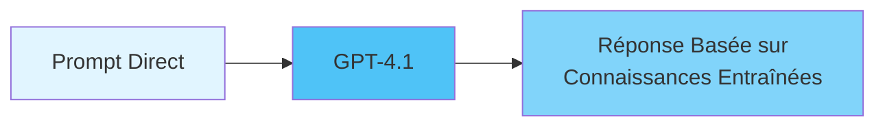
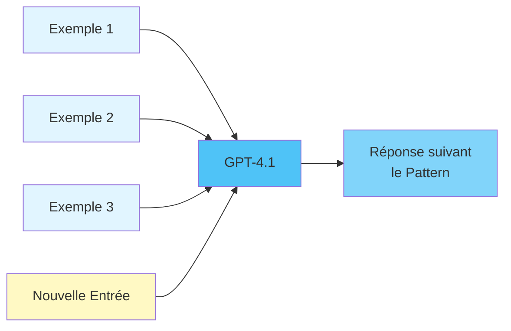
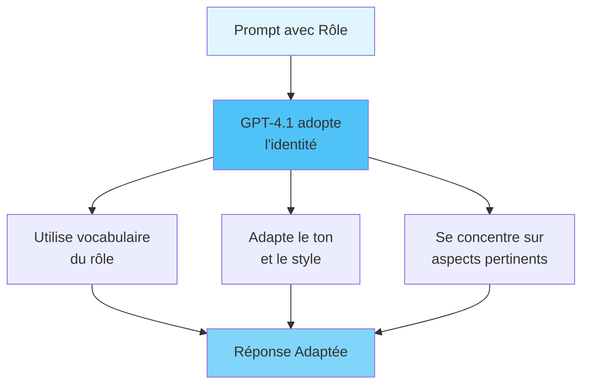
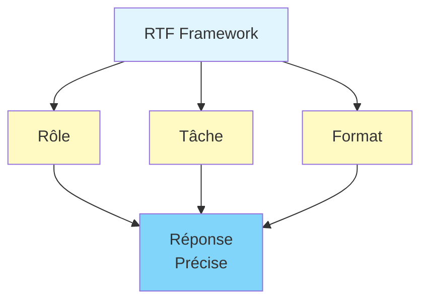
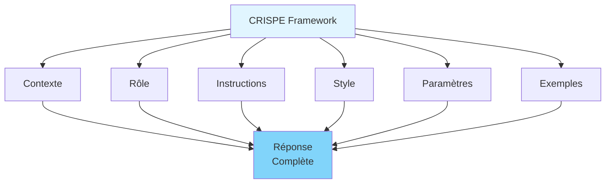
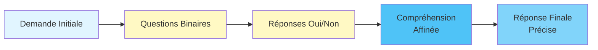
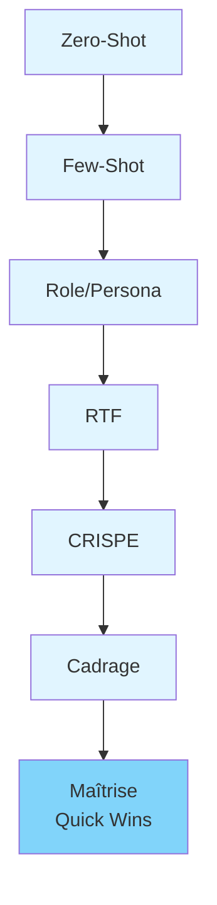

# Formation Prompt Engineering

Microsoft 365 Copilot

**Session 1 : Quick Wins**

Centre de service métier financement  
Institution financière québécoise

## Objectifs de la Formation

- Passer d'un usage basique à une maîtrise avancée du prompt engineering
- Maîtriser 9 techniques de prompt engineering
- Appliquer les techniques dans le contexte bancaire québécois et Spring Boot
- Comprendre la philosophie : **"Un prompt est un outil pour construire des outils"**

## Public Cible

- Testeurs
- Gestionnaires TI
- Product Owners
- Analystes fonctionnels
- Scrum Masters

## Structure de la Formation

- **Session 1 (3.5h)** : Quick Wins - 6 techniques de base
- **Session 2 (3.5h)** : Techniques Avancées - 3 techniques complexes
- **Total** : 7 heures de formation

## Contexte d'Application

- **Secteur** : Bancaire québécois (réglementation AMF)
- **Technique** : API Spring Boot backend
- **Outils** : Jira et Confluence
- **Plateforme IA** : Microsoft 365 Copilot (GPT-4.1)

## Philosophie Centrale

**"Un prompt est un outil pour construire des outils"**

- Les prompts peuvent être utilisés de manière récursive
- Créer des templates et des solutions complexes
- Construire des outils avec des outils

## Vue d'Ensemble Session 1

**Objectif** : Techniques simples et rapides avec bénéfices immédiats

**Focus** : Impact rapide, motivation, application directe

**6 Techniques** :

1. Zero-Shot Prompting
2. Few-Shot Prompting
3. Role/Persona Prompting
4. RTF (Role Task Format)
5. CRISPE
6. Cadrage par Questions Binaires

## Module 01 : Zero-Shot Prompting

**Durée** : 35-40 minutes  
**Niveau** : Quick Win

## Qu'est-ce que le Zero-Shot Prompting ?

Instruction ou question directe au modèle **sans exemples** dans le prompt.

Le modèle s'appuie uniquement sur son entraînement pré-existant (GPT-4.1).



## Comment ça Fonctionne ?

- Le modèle analyse l'instruction directement
- Correspondance avec connaissances entraînées
- Génération basée sur patterns appris
- Aucun exemple nécessaire

**Avantage** : Rapidité et simplicité

## Quand Utiliser le Zero-Shot Prompting ?

**Cas d'usage** :

- ✅ Tâches simples et bien définies
- ✅ Questions factuelles ou analytiques
- ✅ Génération de contenu basique
- ✅ Documentation basique
- ✅ Code simple

**Limitations** :

- ❌ Moins précis pour tâches complexes
- ❌ Peut nécessiter plusieurs itérations

## Structure d'un Prompt Zero-Shot

```
[Instruction ou question claire et précise]
```

**Éléments clés** :

- Instruction directe
- Langage clair et sans ambiguïté
- Spécification du format si nécessaire
- Contexte minimal mais suffisant

## Exemple : Contexte Bancaire Québécois

**Prompt** :

```
Expliquez les exigences de l'Autorité des marchés financiers (AMF) 
concernant la gestion des risques opérationnels pour une institution 
financière québécoise opérant dans le secteur du financement.
```

**Résultat** : Explication détaillée avec références réglementaires

**Contexte** : Gestionnaire TI préparant un rapport de conformité

## Exemple : Contexte Spring Boot

**Prompt** :

```
Créez un contrôleur REST Spring Boot pour un endpoint 
GET /api/comptes/{numeroCompte} qui permet de consulter les 
informations d'un compte bancaire. L'endpoint doit inclure 
la gestion d'erreurs (compte inexistant), la validation des 
paramètres, et retourner les informations au format JSON.
```

**Résultat** : Code Spring Boot complet avec annotations

**Contexte** : Développeur créant une nouvelle API

## Bonnes Pratiques - Zero-Shot

1. Formulez des instructions claires et précises
2. Utilisez un langage direct
3. Spécifiez le format de réponse souhaité
4. Ajoutez du contexte minimal mais pertinent

## Pièges à Éviter - Zero-Shot

- ❌ Instructions trop vagues
- ❌ Manque de contexte
- ❌ Attentes irréalistes
- ❌ Oubli de spécifier le format

## Introduction à Markdown

**Bases** :

- Titres : `#`, `##`, `###`
- Listes à puces : `-` ou `*`
- Code inline : `` `code` ``
- Blocs de code : ` ``` `

## Points Clés Module 01

- Technique simple et rapide
- Pas besoin d'exemples
- Efficace pour tâches courantes
- Base pour autres techniques

**Action** : Pratiquez avec Copilot maintenant !

## Module 02 : Few-Shot Prompting

**Durée** : 35-40 minutes  
**Niveau** : Quick Win

## Qu'est-ce que le Few-Shot Prompting ?

Inclure **quelques exemples** de paires entrée-sortie dans le prompt pour démontrer le format, le style ou le pattern désiré.

**Nombre optimal** : 3-5 exemples généralement suffisants



## Comment ça Fonctionne - Few-Shot

1. Le modèle analyse les exemples fournis
2. Identification des patterns communs
3. Inférence des règles implicites
4. Application du pattern à la nouvelle demande

**Avantage** : Meilleure précision pour formats spécifiques

## Quand Utiliser le Few-Shot Prompting ?

**Cas d'usage** :

- ✅ Format de sortie spécifique requis
- ✅ Style d'écriture particulier
- ✅ Patterns complexes difficiles à décrire
- ✅ Transformation de données
- ✅ Génération suivant un template précis

**Avantages** :

- Précision améliorée
- Cohérence du format
- Flexibilité pour patterns complexes

## Structure d'un Prompt Few-Shot

```
[Contexte ou instruction]

[Exemple 1 - Entrée]
[Exemple 1 - Sortie]

[Exemple 2 - Entrée]
[Exemple 2 - Sortie]

[Exemple 3 - Entrée]
[Exemple 3 - Sortie]

[Nouvelle entrée à traiter]
```

**Éléments clés** : 3-5 exemples représentatifs, format cohérent

## Exemple : Format de Documentation API Spring Boot

**Prompt** :

```
Créez la documentation d'endpoints Spring Boot au format suivant :

Exemple 1 :
Endpoint : GET /api/comptes/{id}
Documentation :
## GET /api/comptes/{id}
### Description
Récupère les informations détaillées d'un compte bancaire.
[...]

Exemple 2 :
Endpoint : POST /api/comptes
Documentation :
## POST /api/comptes
[...]

Maintenant, documentez :
Endpoint : PUT /api/comptes/{id}/depot
```

**Résultat** : Documentation au même format

## Bonnes Pratiques - Few-Shot

1. Sélectionnez des exemples représentatifs
2. Maintenez la cohérence du format
3. Utilisez 3-5 exemples optimalement
4. Séparez clairement les exemples de la demande

## Markdown : Tableaux et Code

**Nouveaux éléments** :

- Tableaux Markdown
- Blocs de code avec syntaxe
- Formatage de code dans les prompts

**Exemple** : Utilisation dans les prompts few-shot

## Points Clés Module 02

- 3-5 exemples généralement suffisants
- Format cohérent entre exemples
- Meilleure précision pour formats spécifiques
- Base pour techniques plus avancées

## Module 03 : Role/Persona Prompting

**Durée** : 30-35 minutes  
**Niveau** : Quick Win

## Qu'est-ce que le Role/Persona Prompting ?

Assigner à l'IA une **identité, un rôle ou une expertise spécifique** pour façonner le ton, le focus et le style de sa réponse.

**Types de rôles** :

- Rôles techniques (développeur, architecte, testeur)
- Rôles métier (analyste bancaire, gestionnaire risques)
- Rôles pédagogiques (formateur, mentor)



## Comment ça Fonctionne - Role/Persona

1. Le modèle adopte l'identité du rôle assigné
2. Utilise le vocabulaire et les connaissances associés
3. Adapte le ton et le style de communication
4. Se concentre sur les aspects pertinents pour ce rôle

**Impact** : Réponses plus pertinentes et adaptées

## Quand Utiliser le Role/Persona Prompting ?

**Cas d'usage** :

- ✅ Besoin d'expertise spécialisée
- ✅ Adaptation du ton à l'audience
- ✅ Génération de contenu pour un rôle spécifique
- ✅ Analyse sous une perspective particulière
- ✅ Code suivant les pratiques d'un rôle

**Avantages** :

- Pertinence améliorée
- Ton approprié
- Expertise simulée
- Flexibilité

## Structure d'un Prompt avec Rôle

```
Vous êtes [rôle/persona spécifique].

[Description du rôle et de son expertise]

[Contexte ou tâche à accomplir]

[Instructions spécifiques]
```

**Éléments clés** : Définition claire du rôle, contexte, instructions

## Exemple : Rôle Technique

**Prompt** :

```
Vous êtes un développeur Spring Boot senior avec 10 ans 
d'expérience dans le développement d'APIs bancaires au Québec, 
spécialisé en sécurité et conformité réglementaire AMF.

Analysez ce code de contrôleur Spring Boot et suggérez des 
améliorations pour la sécurité, la performance et la conformité 
aux règles bancaires québécoises :

[code à analyser]
```

**Résultat** : Analyse détaillée avec recommandations spécialisées

## Exemple : Rôle Métier

**Prompt** :

```
Vous êtes un analyste fonctionnel senior spécialisé dans les 
systèmes bancaires québécois, avec une expertise en conformité 
réglementaire AMF.

Rédigez les spécifications fonctionnelles pour un endpoint API 
POST /api/transactions qui permet d'effectuer un virement bancaire 
entre deux comptes, en respectant les règles de conformité québécoises.
```

**Résultat** : Spécifications fonctionnelles complètes avec règles métier

## Bonnes Pratiques - Role/Persona

1. Définissez le rôle clairement et spécifiquement
2. Ajoutez du contexte au rôle (expertise, expérience)
3. Combinez avec d'autres techniques (RTF, CRISPE)
4. Adaptez le rôle à la tâche

## Points Clés Module 03

- Technique très simple à comprendre
- Impact immédiat sur la pertinence
- Facile à combiner avec autres techniques
- Adaptable à tous les contextes

## Module 04 : RTF (Role Task Format)

**Durée** : 40-45 minutes  
**Niveau** : Quick Win

## Qu'est-ce que le RTF ?

Framework structuré en **3 composantes** :

- **Rôle** (Role) : Qui est l'IA
- **Tâche** (Task) : Ce qui doit être accompli
- **Format** (Format) : Comment la réponse doit être structurée



## Comment ça Fonctionne - RTF

1. Le rôle active les connaissances appropriées
2. La tâche définit précisément l'objectif
3. Le format guide la structure de la réponse
4. La combinaison assure une réponse complète

**Avantage** : Particulièrement efficace pour création de contenu structuré

## Quand Utiliser le RTF ?

**Cas d'usage** :

- ✅ Création de contenu structuré (rapports, documentation)
- ✅ Génération de documents professionnels
- ✅ Production de rapports d'analyse
- ✅ Rédaction de spécifications techniques
- ✅ Création de documentation API

**Avantages** :

- Clarté et complétude
- Cohérence
- Efficacité
- Réutilisabilité

## Structure RTF

```
Rôle : [Définition du rôle de l'IA]

Tâche : [Description précise de la tâche à accomplir]

Format : [Spécification du format attendu de la réponse]
```

**Éléments clés** : Chaque composante doit être claire et spécifique

## Exemple RTF : Rapport d'Analyse

**Prompt** :

```
Rôle : Vous êtes un architecte logiciel senior spécialisé dans 
l'optimisation de performance d'APIs Spring Boot dans des environnements 
bancaires à haute charge au Québec.

Tâche : Analysez les métriques de performance pour l'endpoint 
GET /api/comptes/{id}/transactions et identifiez les goulots 
d'étranglement, opportunités d'optimisation, et risques.

Format : Rapport structuré avec :
1. Résumé exécutif
2. Analyse des métriques (tableau)
3. Goulots d'étranglement (liste)
4. Recommandations (liste numérotée)
5. Risques (tableau)
```

**Résultat** : Rapport complet structuré

## Bonnes Pratiques RTF

1. Définissez chaque composante clairement
2. Utilisez des séparateurs visuels
3. Soyez spécifique dans le format
4. Adaptez le RTF au contexte

## Points Clés Module 04

- Framework structuré en 3 composantes
- Particulièrement efficace pour contenu structuré
- Facile à appliquer avec résultats immédiats
- Réutilisable comme template

## Module 05 : CRISPE

**Durée** : 45-50 minutes  
**Niveau** : Quick Win

## Qu'est-ce que le CRISPE ?

Framework structuré en **6 sections** :

- **C**ontexte (Context)
- **R**ôle (Role)
- **I**nstructions (Instructions)
- **S**tyle (Style)
- **P**aramètres (Parameters)
- **E**xemples (Examples)



## Les 6 Sections du CRISPE

1. **Contexte** : Background et informations pertinentes
2. **Rôle** : Expertise assignée à l'IA
3. **Instructions** : Tâche détaillée à accomplir
4. **Style** : Ton et manière de présenter
5. **Paramètres** : Caractéristiques de sortie (longueur, format)
6. **Exemples** : Exemples concrets illustrant le résultat

**Avantage** : Framework complet pour prompts complexes

## Quand Utiliser le CRISPE ?

**Cas d'usage** :

- ✅ Prompts complexes nécessitant structure complète
- ✅ Génération de contenu avec exigences multiples
- ✅ Documentation technique détaillée
- ✅ Rapports d'analyse complexes
- ✅ Spécifications fonctionnelles complètes

**Avantages** :

- Complétude
- Précision
- Cohérence
- Flexibilité

## Structure d'un Prompt CRISPE

```
Contexte : [Background et contexte]

Rôle : [Rôle et expertise]

Instructions : [Instructions détaillées]

Style : [Style, ton, manière de présenter]

Paramètres : [Caractéristiques de sortie]

Exemples : [Exemples concrets]
```

**Éléments clés** : Toutes les sections doivent être remplies

## Exemple CRISPE : Documentation API

**Prompt** (extrait) :

```
Contexte : API Spring Boot pour système bancaire québécois. 
Endpoint GET /api/comptes/{id}/transactions avec pagination.

Rôle : Développeur Spring Boot senior spécialisé en documentation 
technique.

Instructions : Créez documentation complète incluant description, 
paramètres, réponses, sécurité, limitations, exemples.

Style : Documentation technique professionnelle, claire et structurée.

Paramètres : 600-800 mots, Markdown, sections hiérarchiques.

Exemples : [Exemple de structure similaire]
```

**Résultat** : Documentation exhaustive suivant le format

## Bonnes Pratiques CRISPE

1. Remplissez toutes les sections
2. Soyez spécifique dans chaque section
3. Adaptez le niveau de détail
4. Utilisez des séparateurs visuels

## Markdown : Sections et Structure

**Éléments avancés** :

- Sections hiérarchiques pour structurer CRISPE
- Formatage de code blocks pour exemples
- Tableaux pour paramètres

**Exemple** : Utilisation dans prompts CRISPE

## Points Clés Module 05

- Framework complet en 6 sections
- Permet de structurer efficacement prompts complexes
- Accessible malgré sa complétude
- Base pour techniques avancées

## Module 06 : Cadrage par Questions Binaires

**Durée** : 30-35 minutes  
**Niveau** : Quick Win

## Qu'est-ce que le Cadrage par Questions Binaires ?

Utiliser des **questions à réponse oui/non** pour guider l'IA vers une compréhension précise des besoins avant de générer la réponse finale.

**Objectif** : Clarifier les ambiguïtés et affiner progressivement la demande



## Comment ça Fonctionne - Cadrage

1. Identification des ambiguïtés dans la demande
2. Génération de questions binaires pertinentes
3. Utilisation des réponses pour affiner la compréhension
4. Génération de la réponse finale avec précision

**Avantage** : Réponses plus précises grâce à la clarification

## Quand Utiliser le Cadrage ?

**Cas d'usage** :

- ✅ Demandes ambiguës ou incomplètes
- ✅ Besoin de clarifier préférences ou contraintes
- ✅ Génération de contenu avec plusieurs options
- ✅ Code avec choix de design à faire
- ✅ Documentation avec variantes possibles

**Avantages** :

- Précision améliorée
- Clarté
- Personnalisation
- Efficacité

## Structure avec Cadrage

```
[Demande initiale]

Avant de répondre, répondez aux questions suivantes :

1. [Question binaire 1] (Oui/Non)
2. [Question binaire 2] (Oui/Non)
3. [Question binaire 3] (Oui/Non)

[Instructions pour utiliser les réponses]
```

**Éléments clés** : 3-5 questions ciblées, réponses claires

## Exemple : Génération de Code

**Prompt** :

```
Créez un endpoint Spring Boot pour gérer les virements bancaires.

Questions de cadrage :
1. L'endpoint doit-il supporter les virements externes ? (Oui/Non)
2. Validation selon limites réglementaires québécoises ? (Oui/Non)
3. Gestion des transactions en lot ? (Oui/Non)
4. Sécurisé avec JWT ? (Oui/Non)
5. Journalisation pour conformité AMF ? (Oui/Non)

Réponses : Oui, Oui, Non, Oui, Oui

Générez maintenant le code complet.
```

**Résultat** : Code précis selon clarifications

## Bonnes Pratiques - Cadrage

1. Identifiez les ambiguïtés potentielles
2. Formulez des questions claires et binaires
3. Limitez le nombre de questions (3-5)
4. Utilisez les réponses pour affiner

## Points Clés Module 06

- Technique simple et efficace
- Améliore la précision des réponses
- Clarifie les ambiguïtés
- Facile à appliquer

## Récapitulatif Session 1

**Les 6 Techniques Quick Wins** :

1. Zero-Shot Prompting - Simple et rapide
2. Few-Shot Prompting - Format spécifique
3. Role/Persona Prompting - Expertise adaptée
4. RTF - Structure en 3 composantes
5. CRISPE - Framework complet en 6 sections
6. Cadrage par Questions Binaires - Précision améliorée



## Progression Session 1

**Du simple au structuré** :

- Début : Techniques simples (Zero-Shot)
- Milieu : Techniques structurées (RTF, CRISPE)
- Fin : Techniques de précision (Cadrage)

**Intégration Markdown** :

- Bases introduites progressivement
- Utilisation dans les prompts
- Prêt pour Session 2

## Applications Pratiques

**Par rôle** :

- **Testeurs** : Tests d'API, documentation de bugs
- **Gestionnaires TI** : Rapports de performance, analyses
- **Product Owners** : User stories, backlog refinement
- **Analystes fonctionnels** : Spécifications, documentation
- **Scrum Masters** : Rétrospectives, planification

**Contexte** : Bancaire québécois et Spring Boot

## Prochaines Étapes

**Session 2 - Techniques Avancées** :

- Chain-of-Thought (CoT) Prompting
- Prompt Chaining
- Self-Refinement/Reflection

**Objectif** : Intégrer toutes les techniques pour résoudre des problèmes complexes

**Action** : Pratiquez les Quick Wins avant la Session 2 !

## Questions et Discussion

**Points à discuter** :

- Applications pratiques par rôle
- Cas d'usage spécifiques
- Défis rencontrés
- Partage de bonnes pratiques

**Ressources** : Matériel de référence disponible

## Merci pour votre Participation !

**Session 1 : Quick Wins - Terminée**

**À bientôt pour la Session 2 !**

**Contact** : [Informations de contact]
