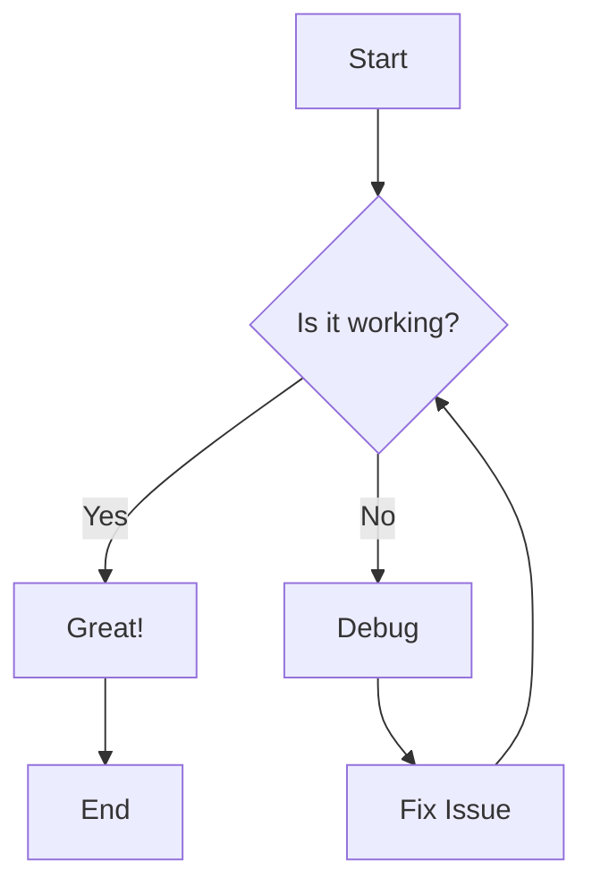
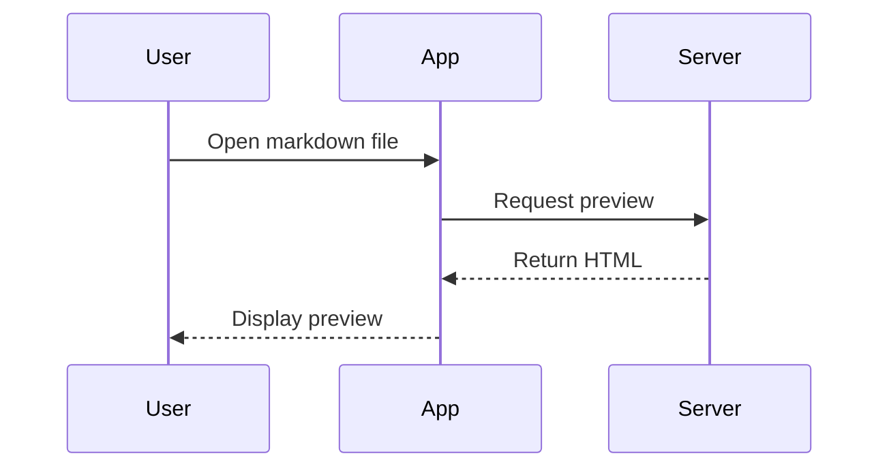
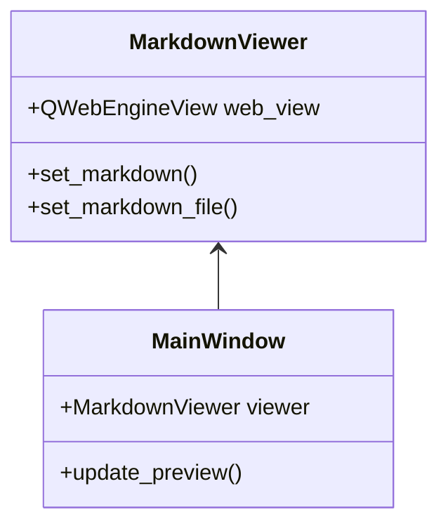

# Sample Document with Mermaid Diagrams

This is a sample markdown document to demonstrate **Mermaid.js diagram rendering** in the md2office viewer.

## Flowchart Example



## Sequence Diagram Example



## Class Diagram Example



## Code Blocks (with syntax highlighting)

Here's a Python example:

```python
def render_markdown(content: str) -> str:
    """Render markdown to HTML."""
    import markdown
    md = markdown.Markdown(extensions=['fenced_code', 'tables'])
    return md.convert(content)
```

And JavaScript:

```javascript
function renderMermaid() {
    mermaid.initialize({ startOnLoad: true });
    mermaid.run();
}
```

## Lists and Formatting

- **Bold text** and *italic text*
- `Inline code` examples
- [Links](https://example.com)

### Ordered List

1. First item
2. Second item
3. Third item

## Tables

| Feature | Status | Notes |
|---------|--------|-------|
| Markdown Rendering | ✅ | Working |
| Mermaid Diagrams | ✅ | Supported |
| Syntax Highlighting | ✅ | highlight.js |

## Conclusion

The markdown viewer now supports:
- Standard markdown syntax
- Mermaid.js diagrams
- Syntax highlighting
- Image rendering
- Tables and lists

